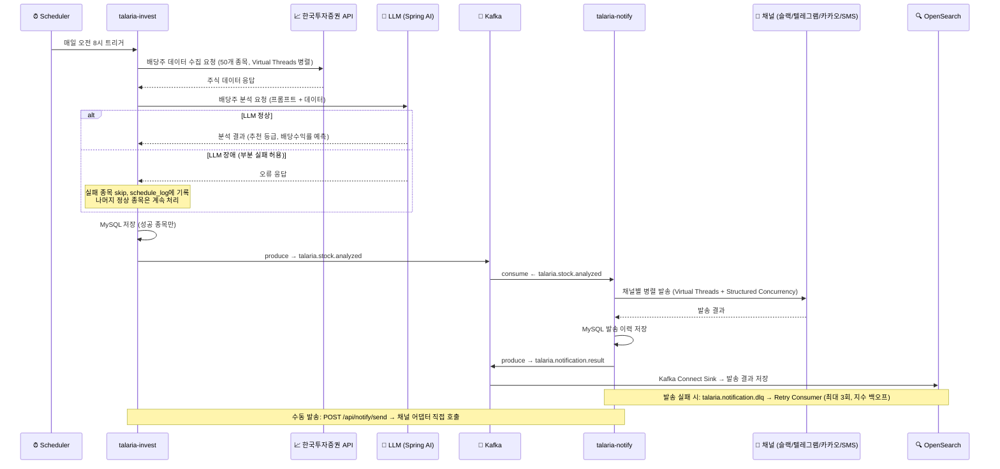
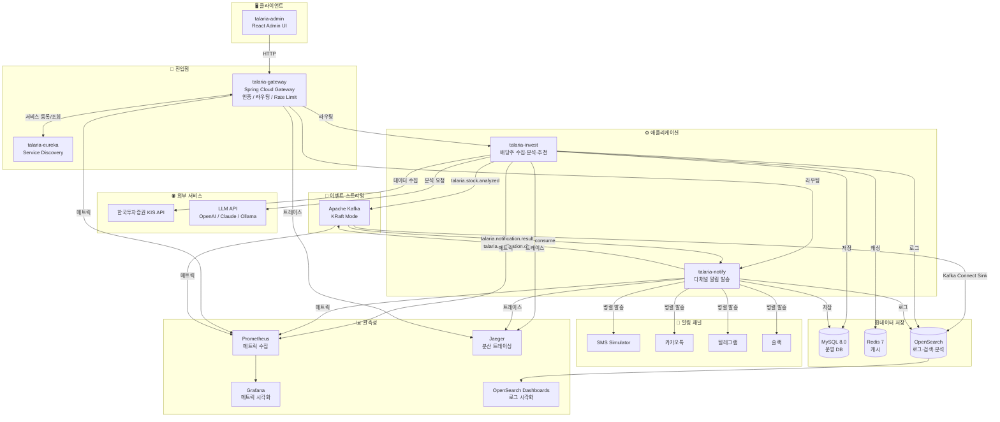
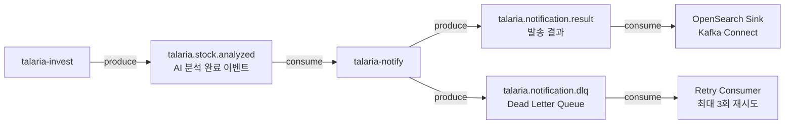

# Talaria — 프로젝트 개요

> 헤르메스의 날개 달린 황금 샌들 **Talaria** —
> 빠르고 경쾌하게, 배당주 소식을 다채널로 전달하는 알림 허브

---

## 프로젝트 한 줄 정의

배당주를 분석하고, 그 결과를 SMS·카카오톡·텔레그램·슬랙으로 자동 발송하는
**개인용 다채널 알림 플랫폼**

---

## 핵심 비즈니스 플로우

---

## 전체 시스템 아키텍처

---

## Kafka 토픽 설계

> 셀프 토픽 없음 — 서비스 간 통신에만 Kafka 사용, 서비스 내부 흐름은 직접 처리

| 토픽 | Producer | Consumer | 목적 |
|------|----------|----------|------|
| `talaria.stock.analyzed` | talaria-invest | talaria-notify | 분석 완료 → 알림 트리거 |
| `talaria.notification.result` | talaria-notify | OpenSearch Sink | 발송 결과 저장·분석 |
| `talaria.notification.dlq` | talaria-notify | Retry Consumer | 실패 메시지 재처리 |

---

## 모노레포 서비스 구성

| 서비스 | 포트 | 역할 |
|--------|------|------|
| talaria-eureka | 8761 | 서비스 디스커버리 |
| talaria-gateway | 8080 | API 단일 진입점 |
| talaria-invest | 8081 | 배당주 수집 · 분석 · AI 추천 |
| talaria-notify | 8082 | 다채널 알림 발송 |
| talaria-admin | 3000 | React 관리자 UI |

## 인프라 포트 구성

| 인프라 | 포트 | 역할 |
|--------|------|------|
| MySQL | 3306 | 운영 데이터베이스 |
| Redis | 6379 | 캐시 · Rate Limit |
| Kafka | 9092 | 이벤트 스트리밍 |
| Kafka UI | 8090 | Kafka 관리 콘솔 |
| OpenSearch | 9200 | 로그 · 검색 · 분석 |
| OpenSearch Dashboards | 5601 | 로그 시각화 |
| Prometheus | 9090 | 메트릭 수집 |
| Grafana | 3001 | 메트릭 대시보드 |
| Jaeger UI | 16686 | 분산 트레이싱 |

---

## 기술 스택 요약

| 분류 | 기술 |
|------|------|
| 언어 | Java 25 |
| 프레임워크 | Spring Boot 4.x · Spring Cloud |
| 빌드 | Gradle Multi-project (Kotlin DSL) |
| 패키지 | `io.github.snuggle.talaria` |
| 배포 | Docker Compose |
| 동시성 | Virtual Threads (Project Loom) |
