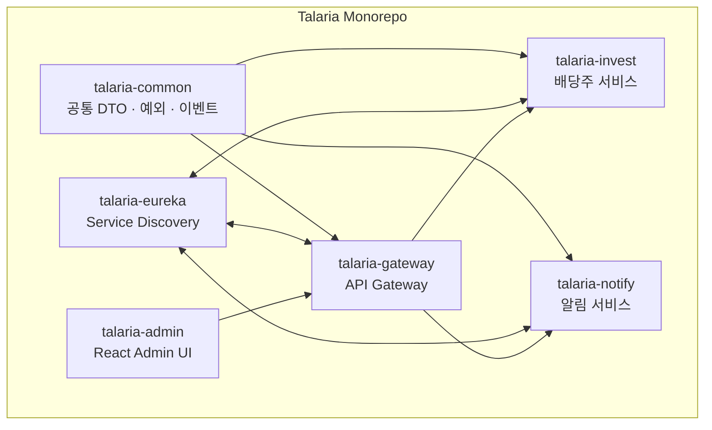

# Talaria — 서비스 상세 설명

---

## 서비스 간 관계



---

## talaria-common

**역할**: 서비스 간 공유되는 코드

Spring 의존성이 없는 **순수 Java 라이브러리**

```
제공하는 것
├── ApiResponse<T>         공통 API 응답 래퍼
├── ErrorCode              에러 코드 열거형
├── BusinessException      비즈니스 예외
├── NotificationEvent      Kafka 이벤트 DTO
└── PageResponse<T>        페이징 응답
```

**왜 별도 모듈로?**
```
invest와 notify가 같은 Kafka 이벤트 DTO를 씁니다.
각 서비스에 복사하면 변경 시 두 곳을 수정해야 합니다.
common에 한 번 정의 → 두 서비스가 같은 클래스 사용
```

---

## talaria-eureka

**역할**: 서비스 디스커버리 서버

```
시작 순서: eureka → gateway → invest, notify
            (eureka가 먼저 있어야 나머지가 등록 가능)

각 서비스가 시작 시:
  "나 talaria-invest야, http://172.18.0.5:8081 에 있어"
  → Eureka에 등록

gateway가 invest 호출 시:
  "talaria-invest 어디있어?" → Eureka 조회
  → 실제 주소로 로드밸런싱
```

포트: **8761** | Eureka Dashboard: `http://localhost:8761`

---

## talaria-gateway

**역할**: 모든 외부 요청의 단일 진입점

포트: **8080**

### 처리하는 것

```
1. 인증
   ├── API Key (X-Api-Key 헤더)  → 외부 서비스 호출용
   └── JWT Bearer Token          → 관리자 UI 로그인용

2. 라우팅
   ├── /api/invest/**  → talaria-invest (lb://talaria-invest)
   └── /api/notify/**  → talaria-notify (lb://talaria-notify)

3. Rate Limiting
   └── Redis 기반, IP당 분당 60 요청 제한

4. CORS
   └── talaria-admin (localhost:3000) 허용
```

### 인증 우회 경로
```
POST /api/auth/login   → JWT 발급 (인증 불필요)
GET  /actuator/health  → 헬스체크 (인증 불필요)
```

---

## talaria-invest

**역할**: 배당주 수집 · 분석 · AI 추천

포트: **8081**

### 핵심 플로우

```
1. 데이터 수집 (매일 오전 8시)
   Scheduler → KIS API (한국투자증권)
   → 50개 종목 데이터 수집 (Virtual Threads 병렬)

2. AI 분석 (부분 실패 허용)
   수집 데이터 → Spring AI (LLM) 분석 요청
   → 추천 등급, 예상 배당수익률 산출
   → LLM 장애 시: 해당 종목 skip, schedule_log 기록
   → 성공 종목만 MySQL 저장
   → Kafka talaria.stock.analyzed produce

3. 조회 API
   GET /api/invest/stocks      → 종목 목록
   GET /api/invest/analysis    → 오늘의 분석 결과
   GET /api/invest/recommend   → 추천 종목
```

### Hexagonal Architecture (포트 & 어댑터)

```
adapter/in/web          → HTTP 요청 수신 (Controller)
application/usecase     → 비즈니스 로직
application/port/out    → 외부 의존성 인터페이스 정의
adapter/out/persistence → MySQL JPA 구현체
adapter/out/market      → KIS API 구현체
adapter/out/ai          → Spring AI 구현체
adapter/out/notification→ Kafka produce 구현체
```

**Port 인터페이스 덕분에:**
- KIS API → 다른 증권사 API로 교체 시 구현체만 변경
- OpenAI → Claude → Ollama 교체 시 설정만 변경

### 주요 도메인 모델
```
Stock           종목 (ticker, name, market, currentPrice)
DividendInfo    배당 이력 (year, quarter, dividendPerShare)
AnalysisResult  AI 분석 결과 (grade, targetYield, summary)
Recommendation  추천 (grade, reasoning, validUntil)
```

---

## talaria-notify

**역할**: 다채널 알림 수신 · 발송 · 추적

포트: **8082**

### 핵심 플로우

```
1. 알림 요청 수신
   ├── Kafka talaria.stock.analyzed consume  → 자동 발송
   └── POST /api/notify/send                 → 수동 발송 (채널 어댑터 직접 호출)

2. 채널 라우팅
   요청의 channels 필드로 대상 채널 결정
   → ChannelAdapter 자동 선택

3. 병렬 발송 (Virtual Threads + Structured Concurrency)
   SMS, 카카오, 텔레그램, 슬랙 동시 발송
   → 각 채널 독립적 (한 채널 실패가 다른 채널에 영향 없음)

4. 결과 추적
   → MySQL 발송 이력 저장
   → Kafka talaria.notification.result produce
   → 발송 실패 시 talaria.notification.dlq → Retry Consumer
   → OpenSearch 분석 데이터 적재 (Kafka Connect Sink)
```

### 발송 상태 머신

```
PENDING
  → SENDING  (채널 API 호출 시작)
    → SENT      (API 호출 성공)
      → DELIVERED (수신 확인)
    → FAILED    (API 호출 실패)
      → RETRY    (재시도, 최대 3회, 지수 백오프)
        → SENT   or
        → DLQ    (최종 실패 → Kafka DLQ)
```

### 발송 우선순위

| 우선순위 | 처리 방식 | 사용 예 |
|---------|---------|---------|
| HIGH | 즉시 처리 | 급등/급락 알림 |
| NORMAL | 일반 큐 | 배당 공시 알림 |
| LOW | 배치 처리 | 주간 리포트 |

### ChannelAdapter 인터페이스

```java
interface ChannelAdapter {
    ChannelType channel();           // SMS, KAKAO, TELEGRAM, SLACK
    SendResult send(Notification n); // 발송
    boolean isAvailable();           // 채널 활성화 여부
}
```

**현재 구현체**

| 구현체 | 채널 | 상태 |
|--------|------|------|
| SmsSimulatorAdapter | SMS | 구현 (로그 출력) |
| KakaoTalkAdapter | 카카오톡 | 구현 (나에게 보내기) |
| TelegramAdapter | 텔레그램 | 구현 (Bot API) |
| SlackAdapter | 슬랙 | 구현 (Webhook) |

**채널 추가 방법**
1. `ChannelAdapter` 구현 클래스 작성
2. `application.yml`에 설정 추가
3. 끝. 다른 코드 수정 없음.

---

## talaria-admin

**역할**: 관리자용 모니터링 · 관리 React UI

포트: **3000** (개발) / **80** (Docker Nginx)

### 제공하는 화면

```
대시보드
  ├── 오늘의 배당주 추천 현황
  ├── 채널별 발송 성공률
  ├── 최근 알림 발송 목록
  └── 서비스 헬스 상태

종목 관리
  ├── 종목 목록 (검색)
  ├── 배당 이력 차트
  └── AI 분석 결과

알림 관리
  ├── 발송 이력
  ├── 채널 설정
  ├── 템플릿 관리
  └── 수동 발송

설정
  ├── API Key 관리
  └── 스케줄 설정
```

### 기술 스택
```
React 19 + TypeScript
TanStack Router (파일 기반 라우팅)
TanStack Query (서버 상태)
Zustand (클라이언트 상태)
Tailwind CSS v4 + shadcn/ui
Axios (HTTP, JWT 자동 갱신)
```

---

## 서비스 시작 순서 (Docker Compose)

```
1단계: 인프라
  MySQL · Redis · Kafka · OpenSearch
  (healthcheck 통과까지 대기)

2단계: 플랫폼
  talaria-eureka
  (서비스 등록 준비 완료까지 대기)

3단계: 애플리케이션
  talaria-gateway · talaria-invest · talaria-notify
  (병렬 시작, Eureka에 자동 등록)

4단계: UI
  talaria-admin
  (gateway 시작 후)
```

---

## 서비스 간 통신 방식

| From | To | 방식 | 이유 |
|------|----|------|------|
| admin | gateway | REST (HTTP) | 동기 필요 |
| gateway | invest/notify | REST (lb://) | 동기 필요 |
| invest | notify | **Kafka** | 비동기, 결합도 제거 |
| notify | OpenSearch | **Kafka Connect** | 대량 로그 적재 |
| 각 서비스 | Prometheus | HTTP scrape | 메트릭 수집 |
| 각 서비스 | Jaeger | OTLP gRPC | 트레이스 전송 |
