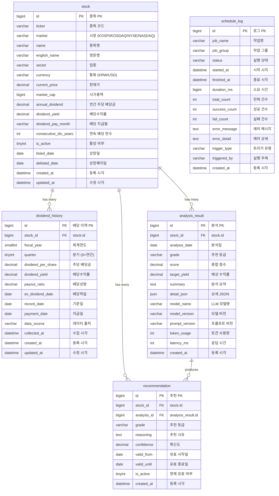
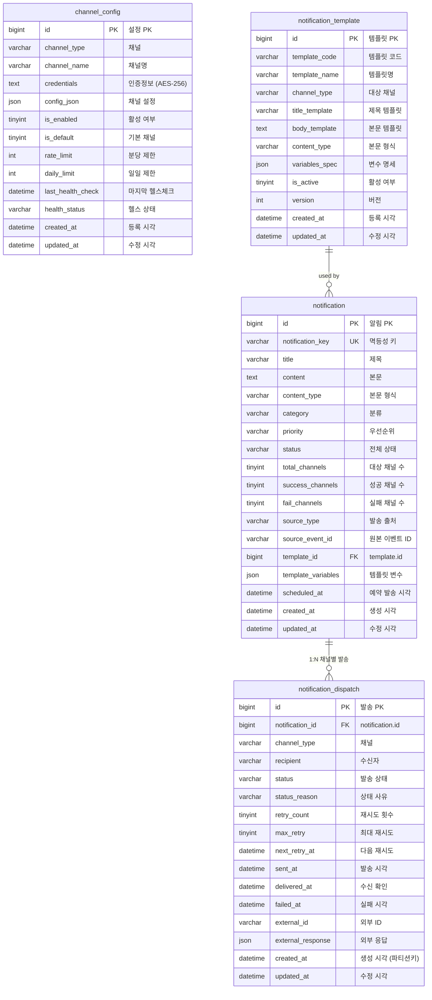

# Talaria -- DB 스키마 설계

> 작성일: 2026-03-14
> 대상 DB: MySQL 8.0, OpenSearch 2.x

---

## 목차

1. [도메인 분석 요약](#1-도메인-분석-요약)
2. [talaria-invest MySQL 스키마](#2-talaria-invest-mysql-스키마)
3. [talaria-notify MySQL 스키마](#3-talaria-notify-mysql-스키마)
4. [인덱스 전략](#4-인덱스-전략)
5. [파티셔닝 전략](#5-파티셔닝-전략)
6. [OpenSearch 인덱스 설계](#6-opensearch-인덱스-설계)
7. [ERD (Mermaid)](#7-erd-mermaid)

---

## 1. 도메인 분석 요약

### 핵심 Aggregate / Entity 식별

**talaria-invest (배당주 분석 Bounded Context)**

| Aggregate Root | Entity / VO | 설명 |
|----------------|-------------|------|
| Stock | - | 종목 정보. ticker가 자연 키이며, 국내(KOSPI/KOSDAQ) 우선, 해외(NYSE/NASDAQ) 확장 |
| Stock | DividendHistory | 연도/분기별 배당 이력. Stock에 종속 |
| AnalysisResult | - | AI 분석 결과. Stock과 N:1 관계. 하루 1회 생성, 이력 보관 |
| Recommendation | - | 최종 추천 등급. AnalysisResult 기반. 최신 1건 유효, 나머지 이력 |
| ScheduleLog | - | 스케줄러 실행 이력 (독립 Aggregate) |

**talaria-notify (알림 발송 Bounded Context)**

| Aggregate Root | Entity / VO | 설명 |
|----------------|-------------|------|
| Notification | NotificationDispatch | 알림 마스터(1) -> 채널별 발송(N) |
| ChannelConfig | - | 채널별 API 설정. credentials 암호화 저장 |
| NotificationTemplate | - | 변수 치환 템플릿 |

### 비즈니스 불변식 (Invariants)

- Stock.ticker + Stock.market 조합은 유일해야 한다
- DividendHistory는 동일 종목의 동일 연도-분기 조합이 유일해야 한다
- Recommendation은 종목당 최신 1개만 `is_active = true`
- Notification.notification_key는 멱등성 보장을 위해 유일해야 한다
- NotificationDispatch 상태 전이는 정해진 상태 머신을 따라야 한다
- ChannelConfig.credentials는 반드시 암호화된 상태로 저장한다

---

## 2. talaria-invest MySQL 스키마

### 2.1 Database 생성

```sql
CREATE DATABASE IF NOT EXISTS talaria_invest
    DEFAULT CHARACTER SET utf8mb4
    DEFAULT COLLATE utf8mb4_unicode_ci;

USE talaria_invest;
```

### 2.2 stock (종목 정보)

```sql
CREATE TABLE stock (
    -- PK
    id              BIGINT          NOT NULL AUTO_INCREMENT          COMMENT '종목 PK (서로게이트 키)',

    -- 비즈니스 식별자
    ticker          VARCHAR(20)     NOT NULL                         COMMENT '종목 코드 (예: 005930, AAPL)',
    market          VARCHAR(10)     NOT NULL                         COMMENT '시장 구분: KOSPI, KOSDAQ, NYSE, NASDAQ',

    -- 종목 기본 정보
    name            VARCHAR(100)    NOT NULL                         COMMENT '종목명 (한글 또는 영문)',
    english_name    VARCHAR(100)    NULL                             COMMENT '종목 영문명 (해외 종목은 name과 동일)',
    sector          VARCHAR(50)     NULL                             COMMENT '업종 (예: 반도체, IT, 금융)',
    currency        VARCHAR(3)      NOT NULL DEFAULT 'KRW'           COMMENT '통화 코드: KRW, USD',

    -- 가격 정보 (최근 수집 시점 기준)
    current_price   DECIMAL(15, 2)  NULL                             COMMENT '현재가',
    market_cap      BIGINT          NULL                             COMMENT '시가총액 (원 또는 달러 단위)',

    -- 배당 요약 (캐시 성격, 최근 연간 기준)
    annual_dividend         DECIMAL(15, 4)  NULL                     COMMENT '최근 연간 주당 배당금',
    dividend_yield          DECIMAL(6, 4)   NULL                     COMMENT '최근 배당수익률 (소수점, 예: 0.0350 = 3.50%)',
    dividend_pay_month      VARCHAR(20)     NULL                     COMMENT '배당 지급월 (예: "3,6,9,12" 또는 "4")',
    consecutive_div_years   INT             NULL DEFAULT 0           COMMENT '연속 배당 연수',

    -- 상태
    is_active       TINYINT(1)      NOT NULL DEFAULT 1               COMMENT '활성 종목 여부 (상장폐지 등 비활성)',
    listed_date     DATE            NULL                             COMMENT '상장일',
    delisted_date   DATE            NULL                             COMMENT '상장폐지일',

    -- 감사 컬럼
    created_at      DATETIME(6)     NOT NULL DEFAULT CURRENT_TIMESTAMP(6)   COMMENT '최초 등록 시각',
    updated_at      DATETIME(6)     NOT NULL DEFAULT CURRENT_TIMESTAMP(6) ON UPDATE CURRENT_TIMESTAMP(6) COMMENT '최종 수정 시각',

    PRIMARY KEY (id),

    -- ticker + market 조합 유일 (국내 005930/KOSPI, 해외 AAPL/NASDAQ)
    CONSTRAINT uk_stock_ticker_market UNIQUE (ticker, market)
) ENGINE=InnoDB DEFAULT CHARSET=utf8mb4 COLLATE=utf8mb4_unicode_ci
  COMMENT='종목 마스터 정보';
```

### 2.3 dividend_history (배당 이력)

```sql
CREATE TABLE dividend_history (
    -- PK
    id              BIGINT          NOT NULL AUTO_INCREMENT          COMMENT '배당 이력 PK',

    -- FK
    stock_id        BIGINT          NOT NULL                         COMMENT 'stock.id FK',

    -- 배당 기간 정보
    fiscal_year     SMALLINT        NOT NULL                         COMMENT '회계연도 (예: 2024)',
    quarter         TINYINT         NOT NULL DEFAULT 0               COMMENT '분기: 0=연간, 1=1Q, 2=2Q, 3=3Q, 4=4Q',

    -- 배당 금액
    dividend_per_share  DECIMAL(15, 4) NOT NULL                      COMMENT '주당 배당금',
    dividend_yield      DECIMAL(6, 4)  NULL                          COMMENT '해당 시점 배당수익률',
    payout_ratio        DECIMAL(7, 4)  NULL                          COMMENT '배당성향 (배당금/순이익, 적자 배당 시 100% 초과 가능)',

    -- 배당 일정
    ex_dividend_date    DATE        NULL                             COMMENT '배당락일',
    record_date         DATE        NULL                             COMMENT '배당 기준일',
    payment_date        DATE        NULL                             COMMENT '배당금 지급일',

    -- 수집 메타
    data_source     VARCHAR(30)     NOT NULL DEFAULT 'KIS'           COMMENT '데이터 출처: KIS, MANUAL, DART',
    collected_at    DATETIME(6)     NOT NULL DEFAULT CURRENT_TIMESTAMP(6) COMMENT '수집 시각',

    -- 감사 컬럼
    created_at      DATETIME(6)     NOT NULL DEFAULT CURRENT_TIMESTAMP(6)   COMMENT '최초 등록 시각',
    updated_at      DATETIME(6)     NOT NULL DEFAULT CURRENT_TIMESTAMP(6) ON UPDATE CURRENT_TIMESTAMP(6) COMMENT '최종 수정 시각',

    PRIMARY KEY (id),

    -- 동일 종목의 동일 연도-분기 배당 중복 방지
    CONSTRAINT uk_dividend_stock_year_quarter UNIQUE (stock_id, fiscal_year, quarter),

    -- ON DELETE RESTRICT: 논리 삭제(is_active=0) 정책, 물리 삭제 방지
    CONSTRAINT fk_dividend_stock FOREIGN KEY (stock_id) REFERENCES stock (id)
        ON DELETE RESTRICT ON UPDATE CASCADE
) ENGINE=InnoDB DEFAULT CHARSET=utf8mb4 COLLATE=utf8mb4_unicode_ci
  COMMENT='종목별 배당 이력 (연도/분기)';
```

### 2.4 analysis_result (AI 분석 결과)

```sql
CREATE TABLE analysis_result (
    -- PK
    id              BIGINT          NOT NULL AUTO_INCREMENT          COMMENT '분석 결과 PK',

    -- FK
    stock_id        BIGINT          NOT NULL                         COMMENT 'stock.id FK',

    -- 분석 일자
    analysis_date   DATE            NOT NULL                         COMMENT '분석 실행일 (하루 1회)',

    -- AI 분석 결과
    grade           VARCHAR(15)     NOT NULL                         COMMENT '추천 등급: STRONG_BUY, BUY, HOLD, SELL',
    CONSTRAINT chk_analysis_grade CHECK (grade IN ('STRONG_BUY', 'BUY', 'HOLD', 'SELL')),
    score           DECIMAL(5, 2)   NULL                             COMMENT 'AI 종합 점수 (0.00 ~ 100.00)',
    target_yield    DECIMAL(6, 4)   NULL                             COMMENT '예상 배당수익률',
    summary         TEXT            NOT NULL                         COMMENT 'AI 분석 요약 텍스트',
    detail_json     JSON            NULL                             COMMENT 'AI 분석 상세 JSON (배당 안정성, 성장성 등 항목별 점수)',

    -- LLM 메타
    model_name      VARCHAR(50)     NOT NULL                         COMMENT '사용된 LLM 모델 (예: gpt-4o, claude-sonnet)',
    model_version   VARCHAR(30)     NULL                             COMMENT '모델 버전',
    prompt_version  VARCHAR(20)     NOT NULL DEFAULT 'v1'            COMMENT '프롬프트 버전 (분석 프롬프트 변경 추적)',
    token_usage     INT             NULL                             COMMENT 'LLM 토큰 사용량',
    latency_ms      INT             NULL                             COMMENT 'LLM 응답 시간 (ms)',

    -- 감사 컬럼
    created_at      DATETIME(6)     NOT NULL DEFAULT CURRENT_TIMESTAMP(6)   COMMENT '최초 등록 시각',

    PRIMARY KEY (id),

    -- 하루에 한 종목 분석 1회
    CONSTRAINT uk_analysis_stock_date UNIQUE (stock_id, analysis_date),

    CONSTRAINT fk_analysis_stock FOREIGN KEY (stock_id) REFERENCES stock (id)
        ON DELETE RESTRICT ON UPDATE CASCADE
) ENGINE=InnoDB DEFAULT CHARSET=utf8mb4 COLLATE=utf8mb4_unicode_ci
  COMMENT='AI 배당주 분석 결과 이력';
```

### 2.5 recommendation (추천)

```sql
CREATE TABLE recommendation (
    -- PK
    id              BIGINT          NOT NULL AUTO_INCREMENT          COMMENT '추천 PK',

    -- FK
    stock_id        BIGINT          NOT NULL                         COMMENT 'stock.id FK',
    analysis_id     BIGINT          NOT NULL                         COMMENT 'analysis_result.id FK (근거 분석)',

    -- 추천 정보
    grade           VARCHAR(15)     NOT NULL                         COMMENT '추천 등급: STRONG_BUY, BUY, HOLD, SELL',
    CONSTRAINT chk_recommendation_grade CHECK (grade IN ('STRONG_BUY', 'BUY', 'HOLD', 'SELL')),
    reasoning       TEXT            NOT NULL                         COMMENT '추천 사유 요약',
    confidence      DECIMAL(5, 2)   NULL                             COMMENT 'AI 확신도 (0.00 ~ 100.00)',

    -- 유효 기간
    valid_from      DATE            NOT NULL                         COMMENT '유효 시작일',
    valid_until     DATE            NOT NULL                         COMMENT '유효 종료일',

    -- 활성 상태 (종목당 최신 1개만 true)
    is_active       TINYINT(1)      NOT NULL DEFAULT 1               COMMENT '현재 유효한 추천 여부',

    -- 감사 컬럼
    created_at      DATETIME(6)     NOT NULL DEFAULT CURRENT_TIMESTAMP(6)   COMMENT '최초 등록 시각',

    PRIMARY KEY (id),

    CONSTRAINT fk_recommendation_stock FOREIGN KEY (stock_id) REFERENCES stock (id)
        ON DELETE RESTRICT ON UPDATE CASCADE,
    CONSTRAINT fk_recommendation_analysis FOREIGN KEY (analysis_id) REFERENCES analysis_result (id)
        ON DELETE RESTRICT ON UPDATE CASCADE
) ENGINE=InnoDB DEFAULT CHARSET=utf8mb4 COLLATE=utf8mb4_unicode_ci
  COMMENT='종목별 투자 추천 (최신 1건 활성)';
```

### 2.6 schedule_log (스케줄러 실행 이력)

```sql
CREATE TABLE schedule_log (
    -- PK
    id              BIGINT          NOT NULL AUTO_INCREMENT          COMMENT '스케줄 로그 PK',

    -- 실행 정보
    job_name        VARCHAR(50)     NOT NULL                         COMMENT '작업명 (예: STOCK_COLLECT, AI_ANALYSIS)',
    job_group       VARCHAR(30)     NOT NULL DEFAULT 'DEFAULT'       COMMENT '작업 그룹',
    status          VARCHAR(15)     NOT NULL                         COMMENT '실행 상태: STARTED, COMPLETED, FAILED, TIMEOUT',

    -- 실행 상세
    started_at      DATETIME(6)     NOT NULL                         COMMENT '실행 시작 시각',
    finished_at     DATETIME(6)     NULL                             COMMENT '실행 종료 시각',
    duration_ms     BIGINT          NULL                             COMMENT '소요 시간 (ms)',

    -- 처리 건수
    total_count     INT             NULL DEFAULT 0                   COMMENT '전체 처리 대상 건수',
    success_count   INT             NULL DEFAULT 0                   COMMENT '성공 건수',
    fail_count      INT             NULL DEFAULT 0                   COMMENT '실패 건수',

    -- 에러 정보
    error_message   TEXT            NULL                             COMMENT '에러 메시지 (실패 시)',
    error_detail    TEXT            NULL                             COMMENT '스택 트레이스 또는 상세 에러',

    -- 트리거 정보
    trigger_type    VARCHAR(15)     NOT NULL DEFAULT 'CRON'          COMMENT '트리거 유형: CRON, MANUAL, EVENT',
    triggered_by    VARCHAR(50)     NULL                             COMMENT '실행 주체 (SYSTEM, 관리자 ID)',

    -- 감사 컬럼
    created_at      DATETIME(6)     NOT NULL DEFAULT CURRENT_TIMESTAMP(6)   COMMENT '등록 시각',

    PRIMARY KEY (id)
) ENGINE=InnoDB DEFAULT CHARSET=utf8mb4 COLLATE=utf8mb4_unicode_ci
  COMMENT='스케줄러 실행 이력';
```

---

## 3. talaria-notify MySQL 스키마

### 3.1 Database 생성

```sql
CREATE DATABASE IF NOT EXISTS talaria_notify
    DEFAULT CHARACTER SET utf8mb4
    DEFAULT COLLATE utf8mb4_unicode_ci;

USE talaria_notify;
```

### 3.2 notification (알림 마스터)

```sql
CREATE TABLE notification (
    -- PK
    id                  BIGINT          NOT NULL AUTO_INCREMENT      COMMENT '알림 PK',

    -- 멱등성 키 (중복 발송 방지)
    notification_key    VARCHAR(64)     NOT NULL                     COMMENT '멱등성 키 (UUID 또는 비즈니스 키)',

    -- 알림 내용
    title               VARCHAR(200)    NOT NULL                     COMMENT '알림 제목',
    content             TEXT            NOT NULL                     COMMENT '알림 본문 (템플릿 렌더링 후)',
    content_type        VARCHAR(15)     NOT NULL DEFAULT 'TEXT'      COMMENT '본문 형식: TEXT, HTML, MARKDOWN',

    -- 분류
    category            VARCHAR(30)     NOT NULL                     COMMENT '알림 분류: STOCK_ANALYSIS, DIVIDEND_ALERT, SYSTEM, CUSTOM',
    priority            VARCHAR(10)     NOT NULL DEFAULT 'NORMAL'    COMMENT '우선순위: HIGH, NORMAL, LOW',

    -- 발송 상태 요약
    status              VARCHAR(15)     NOT NULL DEFAULT 'PENDING'   COMMENT '전체 상태: PENDING, PROCESSING, COMPLETED, PARTIAL_FAIL, FAILED',
    total_channels      TINYINT         NOT NULL DEFAULT 0           COMMENT '발송 대상 채널 수',
    success_channels    TINYINT         NOT NULL DEFAULT 0           COMMENT '발송 성공 채널 수',
    fail_channels       TINYINT         NOT NULL DEFAULT 0           COMMENT '발송 실패 채널 수',

    -- 출처 (어떤 이벤트가 이 알림을 트리거했는가)
    source_type         VARCHAR(20)     NOT NULL DEFAULT 'KAFKA'     COMMENT '발송 요청 출처: KAFKA, API, MANUAL',
    source_event_id     VARCHAR(100)    NULL                         COMMENT '원본 이벤트 ID (Kafka message key 등)',

    -- 템플릿 (선택)
    template_id         BIGINT          NULL                         COMMENT 'notification_template.id FK (템플릿 사용 시)',
    template_variables  JSON            NULL                         COMMENT '템플릿 변수 JSON (예: {"stockName":"삼성전자","grade":"BUY"})',

    -- 예약 발송
    scheduled_at        DATETIME(6)     NULL                         COMMENT '예약 발송 시각 (NULL이면 즉시)',

    -- 감사 컬럼
    created_at          DATETIME(6)     NOT NULL DEFAULT CURRENT_TIMESTAMP(6)   COMMENT '생성 시각',
    updated_at          DATETIME(6)     NOT NULL DEFAULT CURRENT_TIMESTAMP(6) ON UPDATE CURRENT_TIMESTAMP(6) COMMENT '최종 수정 시각',

    PRIMARY KEY (id),

    -- 멱등성 키 유니크
    CONSTRAINT uk_notification_key UNIQUE (notification_key)
) ENGINE=InnoDB DEFAULT CHARSET=utf8mb4 COLLATE=utf8mb4_unicode_ci
  COMMENT='알림 마스터 (발송 요청 단위)';
```

### 3.3 notification_dispatch (채널별 발송 단위)

> 대량 데이터 예상 -> 파티셔닝 적용 (5.2절 참조)

```sql
CREATE TABLE notification_dispatch (
    -- PK
    id                  BIGINT          NOT NULL AUTO_INCREMENT      COMMENT '발송 단위 PK',

    -- FK
    notification_id     BIGINT          NOT NULL                     COMMENT 'notification.id FK',

    -- 채널 정보
    channel_type        VARCHAR(15)     NOT NULL                     COMMENT '채널: SMS, KAKAO, TELEGRAM, SLACK',
    recipient           VARCHAR(200)    NOT NULL                     COMMENT '수신자 식별자 (전화번호, 채팅ID, 채널URL 등)',

    -- 발송 상태 머신: PENDING -> SENDING -> SENT -> DELIVERED / FAILED -> RETRY -> DLQ
    status              VARCHAR(15)     NOT NULL DEFAULT 'PENDING'   COMMENT '발송 상태',
    status_reason       VARCHAR(500)    NULL                         COMMENT '상태 변경 사유 (에러 메시지 등)',

    -- 재시도 정보
    retry_count         TINYINT         NOT NULL DEFAULT 0           COMMENT '현재 재시도 횟수 (최대 3)',
    max_retry           TINYINT         NOT NULL DEFAULT 3           COMMENT '최대 재시도 횟수',
    next_retry_at       DATETIME(6)     NULL                         COMMENT '다음 재시도 예정 시각 (지수 백오프)',

    -- 발송 시각
    sent_at             DATETIME(6)     NULL                         COMMENT 'API 호출 완료 시각',
    delivered_at        DATETIME(6)     NULL                         COMMENT '수신 확인 시각',
    failed_at           DATETIME(6)     NULL                         COMMENT '최종 실패 시각',

    -- 외부 시스템 응답
    external_id         VARCHAR(200)    NULL                         COMMENT '외부 시스템 발송 ID (채널 API 응답)',
    external_response   JSON            NULL                         COMMENT '외부 시스템 응답 원문 (디버깅용)',

    -- 감사 컬럼
    created_at          DATETIME(6)     NOT NULL DEFAULT CURRENT_TIMESTAMP(6)   COMMENT '생성 시각',
    updated_at          DATETIME(6)     NOT NULL DEFAULT CURRENT_TIMESTAMP(6) ON UPDATE CURRENT_TIMESTAMP(6) COMMENT '최종 수정 시각',

    PRIMARY KEY (id, created_at),

    -- [주의] MySQL 파티션 테이블은 FK 제약을 지원하지 않음
    -- notification_id 참조 무결성은 애플리케이션(Service) 레벨에서 보장
    -- 참고: https://dev.mysql.com/doc/refman/8.0/en/partitioning-limitations.html
    INDEX idx_dispatch_notification (notification_id)
) ENGINE=InnoDB DEFAULT CHARSET=utf8mb4 COLLATE=utf8mb4_unicode_ci
  COMMENT='채널별 발송 단위 (Notification 1:N Dispatch)'
  PARTITION BY RANGE (TO_DAYS(created_at)) (
    PARTITION p_2026_01 VALUES LESS THAN (TO_DAYS('2026-02-01')),
    PARTITION p_2026_02 VALUES LESS THAN (TO_DAYS('2026-03-01')),
    PARTITION p_2026_03 VALUES LESS THAN (TO_DAYS('2026-04-01')),
    PARTITION p_2026_04 VALUES LESS THAN (TO_DAYS('2026-05-01')),
    PARTITION p_2026_05 VALUES LESS THAN (TO_DAYS('2026-06-01')),
    PARTITION p_2026_06 VALUES LESS THAN (TO_DAYS('2026-07-01')),
    PARTITION p_2026_07 VALUES LESS THAN (TO_DAYS('2026-08-01')),
    PARTITION p_2026_08 VALUES LESS THAN (TO_DAYS('2026-09-01')),
    PARTITION p_2026_09 VALUES LESS THAN (TO_DAYS('2026-10-01')),
    PARTITION p_2026_10 VALUES LESS THAN (TO_DAYS('2026-11-01')),
    PARTITION p_2026_11 VALUES LESS THAN (TO_DAYS('2026-12-01')),
    PARTITION p_2026_12 VALUES LESS THAN (TO_DAYS('2027-01-01')),
    PARTITION p_future  VALUES LESS THAN MAXVALUE
  );
```

### 3.4 channel_config (채널 설정)

```sql
CREATE TABLE channel_config (
    -- PK
    id              BIGINT          NOT NULL AUTO_INCREMENT          COMMENT '채널 설정 PK',

    -- 채널 식별
    channel_type    VARCHAR(15)     NOT NULL                         COMMENT '채널: SMS, KAKAO, TELEGRAM, SLACK',
    channel_name    VARCHAR(50)     NOT NULL                         COMMENT '채널 표시명 (예: "개인 슬랙", "팀 텔레그램")',

    -- 인증 정보 (반드시 애플리케이션 레벨에서 AES-256 암호화 후 저장)
    -- JPA AttributeConverter 또는 Spring @ColumnTransformer 로 암/복호화
    credentials     TEXT            NOT NULL                         COMMENT '채널 인증 정보 JSON (AES-256 암호화 저장). 예: {"apiKey":"enc:...","botToken":"enc:..."}',

    -- 채널별 설정
    config_json     JSON            NULL                             COMMENT '채널 고유 설정 (Webhook URL, Chat ID, 발신 번호 등)',

    -- 상태
    is_enabled      TINYINT(1)      NOT NULL DEFAULT 1               COMMENT '채널 활성화 여부',
    is_default      TINYINT(1)      NOT NULL DEFAULT 0               COMMENT '기본 발송 채널 여부',

    -- 제한
    rate_limit      INT             NULL                             COMMENT '분당 최대 발송 건수 (NULL이면 무제한)',
    daily_limit     INT             NULL                             COMMENT '일일 최대 발송 건수',

    -- 검증
    last_health_check   DATETIME(6) NULL                             COMMENT '마지막 헬스체크 시각',
    health_status       VARCHAR(10) NULL DEFAULT 'UNKNOWN'           COMMENT '헬스 상태: HEALTHY, UNHEALTHY, UNKNOWN',

    -- 감사 컬럼
    created_at      DATETIME(6)     NOT NULL DEFAULT CURRENT_TIMESTAMP(6)   COMMENT '등록 시각',
    updated_at      DATETIME(6)     NOT NULL DEFAULT CURRENT_TIMESTAMP(6) ON UPDATE CURRENT_TIMESTAMP(6) COMMENT '수정 시각',

    PRIMARY KEY (id),

    CONSTRAINT uk_channel_config_type_name UNIQUE (channel_type, channel_name)
) ENGINE=InnoDB DEFAULT CHARSET=utf8mb4 COLLATE=utf8mb4_unicode_ci
  COMMENT='채널별 API 설정 (credentials는 AES-256 암호화)';
```

### 3.5 notification_template (알림 템플릿)

```sql
CREATE TABLE notification_template (
    -- PK
    id              BIGINT          NOT NULL AUTO_INCREMENT          COMMENT '템플릿 PK',

    -- 식별
    template_code   VARCHAR(50)     NOT NULL                         COMMENT '템플릿 코드 (예: STOCK_RECOMMEND_DAILY)',
    template_name   VARCHAR(100)    NOT NULL                         COMMENT '템플릿 이름',

    -- 채널별 내용 (채널마다 형식이 다를 수 있음)
    channel_type    VARCHAR(15)     NOT NULL                         COMMENT '대상 채널: SMS, KAKAO, TELEGRAM, SLACK, ALL',

    -- 템플릿 내용
    title_template  VARCHAR(200)    NOT NULL                         COMMENT '제목 템플릿 (예: "[Talaria] {{stockName}} 분석 결과")',
    body_template   TEXT            NOT NULL                         COMMENT '본문 템플릿 ({{variable}} 형태의 변수 치환 지원)',
    content_type    VARCHAR(15)     NOT NULL DEFAULT 'TEXT'          COMMENT '본문 형식: TEXT, HTML, MARKDOWN',

    -- 변수 명세
    variables_spec  JSON            NOT NULL                         COMMENT '사용 가능한 변수 목록과 설명 JSON',
    -- 예: [{"name":"stockName","type":"string","required":true},{"name":"grade","type":"string","required":true}]

    -- 상태
    is_active       TINYINT(1)      NOT NULL DEFAULT 1               COMMENT '활성 여부',
    version         INT             NOT NULL DEFAULT 1               COMMENT '템플릿 버전 (수정 시 증가)',

    -- 감사 컬럼
    created_at      DATETIME(6)     NOT NULL DEFAULT CURRENT_TIMESTAMP(6)   COMMENT '등록 시각',
    updated_at      DATETIME(6)     NOT NULL DEFAULT CURRENT_TIMESTAMP(6) ON UPDATE CURRENT_TIMESTAMP(6) COMMENT '수정 시각',

    PRIMARY KEY (id),

    -- 같은 코드 + 채널 조합 유일
    CONSTRAINT uk_template_code_channel UNIQUE (template_code, channel_type)
) ENGINE=InnoDB DEFAULT CHARSET=utf8mb4 COLLATE=utf8mb4_unicode_ci
  COMMENT='알림 템플릿 ({{variable}} 변수 치환 지원)';
```

---

## 4. 인덱스 전략

### 4.1 talaria-invest 인덱스

```sql
USE talaria_invest;

-- ============================================================
-- stock 테이블
-- ============================================================

-- 쿼리: 시장별 활성 종목 목록 조회 (가장 빈번한 조회)
-- SELECT * FROM stock WHERE market = ? AND is_active = 1 ORDER BY name
-- Composite Index: market + is_active + name (Covering 가능)
CREATE INDEX idx_stock_market_active_name
    ON stock (market, is_active, name);

-- 쿼리: 배당수익률 상위 종목 조회 (추천 화면)
-- SELECT * FROM stock WHERE is_active = 1 AND dividend_yield IS NOT NULL ORDER BY dividend_yield DESC
CREATE INDEX idx_stock_active_yield
    ON stock (is_active, dividend_yield DESC);

-- 쿼리: 업종별 조회
-- SELECT * FROM stock WHERE sector = ? AND is_active = 1
CREATE INDEX idx_stock_sector_active
    ON stock (sector, is_active);

-- 쿼리: 최근 업데이트된 종목 확인 (스케줄러 모니터링)
-- SELECT * FROM stock WHERE updated_at < ? AND is_active = 1
CREATE INDEX idx_stock_updated_at
    ON stock (updated_at);


-- ============================================================
-- dividend_history 테이블
-- ============================================================

-- 쿼리: 특정 종목의 연도별 배당 이력 조회 (배당 차트)
-- SELECT * FROM dividend_history WHERE stock_id = ? ORDER BY fiscal_year DESC, quarter
-- UK(stock_id, fiscal_year, quarter)가 이미 이 패턴을 커버
-- 추가 인덱스 불필요 (UK가 Covering Index 역할)

-- 쿼리: 최근 N년간 배당 이력 벌크 조회 (AI 분석 입력)
-- SELECT * FROM dividend_history WHERE fiscal_year >= ? ORDER BY stock_id, fiscal_year
CREATE INDEX idx_dividend_fiscal_year
    ON dividend_history (fiscal_year, stock_id);

-- 쿼리: 배당락일 기준 조회 (배당 캘린더)
-- SELECT * FROM dividend_history WHERE ex_dividend_date BETWEEN ? AND ?
CREATE INDEX idx_dividend_ex_date
    ON dividend_history (ex_dividend_date);


-- ============================================================
-- analysis_result 테이블
-- ============================================================

-- 쿼리: 특정 일자의 전체 분석 결과 (오늘의 분석 API)
-- SELECT * FROM analysis_result WHERE analysis_date = ? ORDER BY score DESC
-- UK(stock_id, analysis_date)는 stock_id 선행이므로 analysis_date 단독 조회에 비효율
CREATE INDEX idx_analysis_date_score
    ON analysis_result (analysis_date, score DESC);

-- 쿼리: 특정 종목의 분석 이력 (종목 상세 화면)
-- UK(stock_id, analysis_date)가 커버

-- 쿼리: 등급별 필터링
-- SELECT * FROM analysis_result WHERE analysis_date = ? AND grade = ?
-- Covering Index: analysis_date + grade + stock_id + score
CREATE INDEX idx_analysis_date_grade
    ON analysis_result (analysis_date, grade, stock_id, score);


-- ============================================================
-- recommendation 테이블
-- ============================================================

-- 쿼리: 활성 추천 목록 (메인 API)
-- SELECT * FROM recommendation WHERE is_active = 1 ORDER BY grade, confidence DESC
CREATE INDEX idx_recommendation_active_grade
    ON recommendation (is_active, grade, confidence DESC);

-- 쿼리: 특정 종목의 추천 이력
-- SELECT * FROM recommendation WHERE stock_id = ? ORDER BY created_at DESC
CREATE INDEX idx_recommendation_stock_created
    ON recommendation (stock_id, created_at DESC);

-- 쿼리: 유효기간 만료 추천 비활성화 (배치)
-- UPDATE recommendation SET is_active = 0 WHERE is_active = 1 AND valid_until < CURDATE()
CREATE INDEX idx_recommendation_active_valid
    ON recommendation (is_active, valid_until);


-- ============================================================
-- schedule_log 테이블
-- ============================================================

-- 쿼리: 작업명별 최근 실행 이력
-- SELECT * FROM schedule_log WHERE job_name = ? ORDER BY started_at DESC LIMIT 10
CREATE INDEX idx_schedule_job_started
    ON schedule_log (job_name, started_at DESC);

-- 쿼리: 실패 로그 조회
-- SELECT * FROM schedule_log WHERE status = 'FAILED' ORDER BY started_at DESC
CREATE INDEX idx_schedule_status_started
    ON schedule_log (status, started_at DESC);
```

### 4.2 talaria-notify 인덱스

```sql
USE talaria_notify;

-- ============================================================
-- notification 테이블
-- ============================================================

-- 쿼리: 상태별 알림 목록 (관리 화면)
-- SELECT * FROM notification WHERE status = ? ORDER BY created_at DESC LIMIT 20
CREATE INDEX idx_notification_status_created
    ON notification (status, created_at DESC);

-- 쿼리: 카테고리 + 우선순위 필터링 (관리 화면)
-- SELECT * FROM notification WHERE category = ? AND priority = ? ORDER BY created_at DESC
CREATE INDEX idx_notification_category_priority
    ON notification (category, priority, created_at DESC);

-- 쿼리: 예약 발송 대상 조회 (스케줄러)
-- SELECT * FROM notification WHERE status = 'PENDING' AND scheduled_at <= NOW()
CREATE INDEX idx_notification_scheduled
    ON notification (status, scheduled_at);

-- 쿼리: 소스 이벤트 기반 조회 (이벤트 추적)
-- SELECT * FROM notification WHERE source_event_id = ?
CREATE INDEX idx_notification_source_event
    ON notification (source_event_id);

-- UK(notification_key)는 이미 존재 - 멱등성 체크에 사용


-- ============================================================
-- notification_dispatch 테이블 (파티션 테이블)
-- ============================================================
-- 주의: 파티션 테이블에서 인덱스는 각 파티션 내에 로컬로 생성됨
-- PK에 파티션 키(created_at)가 포함되어 있으므로 인덱스도 이를 고려

-- 쿼리: 특정 알림의 채널별 발송 현황
-- SELECT * FROM notification_dispatch WHERE notification_id = ?
-- [중복 제거] idx_dispatch_notification은 CREATE TABLE 내부에 이미 정의됨
-- CREATE INDEX idx_dispatch_notification ON notification_dispatch (notification_id);

-- 쿼리: 재시도 대상 조회 (재시도 스케줄러)
-- SELECT * FROM notification_dispatch
--   WHERE status IN ('FAILED', 'RETRY') AND retry_count < max_retry AND next_retry_at <= NOW()
CREATE INDEX idx_dispatch_retry
    ON notification_dispatch (status, next_retry_at, retry_count);

-- 쿼리: 채널별 발송 현황 (대시보드)
-- SELECT channel_type, status, COUNT(*) FROM notification_dispatch
--   WHERE created_at BETWEEN ? AND ? GROUP BY channel_type, status
-- 파티션 프루닝 + 아래 인덱스로 효율적 처리
CREATE INDEX idx_dispatch_channel_status
    ON notification_dispatch (channel_type, status, created_at);

-- 쿼리: DLQ 대상 조회
-- SELECT * FROM notification_dispatch WHERE status = 'DLQ' ORDER BY created_at DESC
-- idx_dispatch_retry가 커버 가능하지만, DLQ 전용 조회가 빈번하면 별도 인덱스 고려
-- 현재는 idx_dispatch_channel_status가 커버


-- ============================================================
-- channel_config 테이블
-- ============================================================
-- 데이터량이 적으므로 (채널 수 x 설정 수 = 수십 건) UK만으로 충분
-- 추가 인덱스 불필요


-- ============================================================
-- notification_template 테이블
-- ============================================================
-- 데이터량이 적으므로 UK만으로 충분
-- 쿼리: 활성 템플릿 조회
-- SELECT * FROM notification_template WHERE is_active = 1 AND channel_type IN ('ALL', ?)
CREATE INDEX idx_template_active_channel
    ON notification_template (is_active, channel_type);
```

### 4.3 인덱스 설계 판단 근거

| 판단 항목 | 기준 |
|-----------|------|
| Composite vs Single | 쿼리 WHERE 조건이 2개 이상 컬럼을 동시에 사용하면 Composite. 단독 필터링이면 Single |
| Covering Index | SELECT에 필요한 컬럼이 적고, 인덱스만으로 응답 가능하면 적용 (예: `idx_analysis_date_grade`) |
| DESC 인덱스 | ORDER BY DESC가 주 패턴인 컬럼에 적용. MySQL 8.0 Descending Index 지원 |
| 파티션 테이블 인덱스 | 파티션 키(created_at)를 WHERE에 포함하는 쿼리가 파티션 프루닝 혜택을 받음 |
| 인덱스 미생성 | 마스터 데이터(channel_config, template)는 건수가 적어 풀스캔이 더 효율적 |

---

## 5. 파티셔닝 전략

### 5.1 파티셔닝 대상 테이블

| 테이블 | 예상 증가율 | 파티셔닝 전략 | 근거 |
|--------|------------|--------------|------|
| notification_dispatch | 일 수백~수천 건 | RANGE (월별) | 시계열 데이터, 기간 검색 빈번 |
| schedule_log | 일 수십 건 | 미적용 | 데이터량 적음 |
| analysis_result | 일 50건 (종목 수) | 미적용 | 연간 약 18,000건, 인덱스로 충분 |

### 5.2 notification_dispatch 파티셔닝 상세

위 3.3절 DDL에 이미 반영되어 있습니다. 핵심 설계 결정:

**파티션 키 선택: `created_at`**
- 발송 이력 조회는 거의 항상 기간 조건 포함 -> 파티션 프루닝 효과 극대화
- PK를 `(id, created_at)` 복합키로 변경 (MySQL 파티션 테이블 제약: 파티션 키가 PK/UK에 포함되어야 함)

**월별 RANGE 파티셔닝**
- 월 단위로 데이터를 분리하여 오래된 데이터 관리 용이
- `ALTER TABLE ... DROP PARTITION` 으로 오래된 월 데이터 빠르게 삭제 가능

**파티션 자동 추가 (운영 자동화)**

```sql
-- 매월 1일에 실행하는 이벤트 스케줄러로 다음 달 파티션 자동 생성
-- 또는 아래 프로시저를 cron/Spring @Scheduled로 호출

DELIMITER $$

CREATE PROCEDURE add_monthly_partition_dispatch()
BEGIN
    DECLARE v_partition_name VARCHAR(20);
    DECLARE v_less_than_date DATE;

    -- 2개월 후 파티션 미리 생성
    SET v_partition_name = CONCAT('p_', DATE_FORMAT(DATE_ADD(CURDATE(), INTERVAL 2 MONTH), '%Y_%m'));
    SET v_less_than_date = DATE_FORMAT(DATE_ADD(CURDATE(), INTERVAL 3 MONTH), '%Y-%m-01');

    SET @sql = CONCAT(
        'ALTER TABLE notification_dispatch REORGANIZE PARTITION p_future INTO (',
        'PARTITION ', v_partition_name, ' VALUES LESS THAN (TO_DAYS(''', v_less_than_date, ''')),',
        'PARTITION p_future VALUES LESS THAN MAXVALUE)'
    );

    PREPARE stmt FROM @sql;
    EXECUTE stmt;
    DEALLOCATE PREPARE stmt;
END$$

DELIMITER ;
```

**오래된 파티션 삭제 (데이터 보존 정책)**

```sql
-- 12개월 이상 된 발송 이력 삭제 (운영 정책에 따라 조정)
-- 삭제 전 OpenSearch에 분석 데이터가 이미 적재되어 있으므로 안전
ALTER TABLE notification_dispatch DROP PARTITION p_2025_01;
```

---

## 6. OpenSearch 인덱스 설계

### 6.1 application-logs (애플리케이션 로그)

**Mapping**

```json
{
  "index_patterns": ["talaria-logs-*"],
  "template": {
    "settings": {
      "index": {
        "number_of_shards": 2,
        "number_of_replicas": 1,   // 운영 환경: 1 / 개발 단일노드: 0 으로 변경
        "refresh_interval": "5s",
        "codec": "best_compression"
      },
      "analysis": {
        "analyzer": {
          "log_analyzer": {
            "type": "custom",
            "tokenizer": "standard",
            "filter": ["lowercase", "trim"]
          }
        }
      }
    },
    "mappings": {
      "properties": {
        "@timestamp": {
          "type": "date",
          "format": "epoch_millis||strict_date_optional_time"
        },
        "service": {
          "type": "keyword",
          "doc_values": true
        },
        "instance_id": {
          "type": "keyword"
        },
        "level": {
          "type": "keyword"
        },
        "logger": {
          "type": "keyword"
        },
        "thread": {
          "type": "keyword"
        },
        "message": {
          "type": "text",
          "analyzer": "log_analyzer",
          "fields": {
            "keyword": {
              "type": "keyword",
              "ignore_above": 512
            }
          }
        },
        "stack_trace": {
          "type": "text",
          "index": false
          // index:false = 검색 불필요, 저장만 (analyzer 제거 - index:false와 모순)
        },
        "trace_id": {
          "type": "keyword"
        },
        "span_id": {
          "type": "keyword"
        },
        "mdc": {
          "type": "object",
          "dynamic": true
        },
        "host": {
          "type": "keyword"
        },
        "environment": {
          "type": "keyword"
        }
      }
    }
  },
  "priority": 100,
  "composed_of": []
}
```

**ILM 정책**

```json
{
  "policy": {
    "description": "Talaria application logs lifecycle - hot/warm/delete",
    "default_state": "hot",
    "states": [
      {
        "name": "hot",
        "actions": [
          {
            "rollover": {
              "min_size": "10gb",
              "min_index_age": "1d"
            }
          }
        ],
        "transitions": [
          {
            "state_name": "warm",
            "conditions": {
              "min_index_age": "3d"
            }
          }
        ]
      },
      {
        "name": "warm",
        "actions": [
          {
            "replica_count": {
              "number_of_replicas": 0
            }
          },
          {
            "force_merge": {
              "max_num_segments": 1
            }
          }
        ],
        "transitions": [
          {
            "state_name": "delete",
            "conditions": {
              "min_index_age": "30d"
            }
          }
        ]
      },
      {
        "name": "delete",
        "actions": [
          {
            "delete": {}
          }
        ],
        "transitions": []
      }
    ],
    "ism_template": [
      {
        "index_patterns": ["talaria-logs-*"],
        "priority": 100
      }
    ]
  }
}
```

### 6.2 notification-analytics (발송 결과 분석)

**Mapping**

```json
{
  "index_patterns": ["talaria-notification-analytics-*"],
  "template": {
    "settings": {
      "index": {
        "number_of_shards": 2,
        "number_of_replicas": 1,   // 운영: 1 / 개발 단일노드: 0 으로 변경
        "refresh_interval": "10s"
      }
    },
    "mappings": {
      "properties": {
        "@timestamp": {
          "type": "date",
          "format": "epoch_millis||strict_date_optional_time"
        },
        "notification_id": {
          "type": "long"
        },
        "notification_key": {
          "type": "keyword"
        },
        "dispatch_id": {
          "type": "long"
        },
        "channel_type": {
          "type": "keyword"
        },
        "status": {
          "type": "keyword"
        },
        "category": {
          "type": "keyword"
        },
        "priority": {
          "type": "keyword"
        },
        "recipient_hash": {
          "type": "keyword",
          "doc_values": true
        },
        "retry_count": {
          "type": "integer"
        },
        "latency_ms": {
          "type": "long"
        },
        "sent_at": {
          "type": "date"
        },
        "delivered_at": {
          "type": "date"
        },
        "failed_at": {
          "type": "date"
        },
        "error_code": {
          "type": "keyword"
        },
        "error_message": {
          "type": "text",
          "fields": {
            "keyword": {
              "type": "keyword",
              "ignore_above": 256
            }
          }
        },
        "source_type": {
          "type": "keyword"
        },
        "source_event_id": {
          "type": "keyword"
        },
        "title": {
          "type": "text",
          "fields": {
            "keyword": {
              "type": "keyword",
              "ignore_above": 200
            }
          }
        }
      }
    }
  }
}
```

**ILM 정책**

```json
{
  "policy": {
    "description": "Notification analytics lifecycle - hot/warm/cold/delete",
    "default_state": "hot",
    "states": [
      {
        "name": "hot",
        "actions": [
          {
            "rollover": {
              "min_size": "20gb",
              "min_index_age": "7d"
            }
          }
        ],
        "transitions": [
          {
            "state_name": "warm",
            "conditions": {
              "min_index_age": "14d"
            }
          }
        ]
      },
      {
        "name": "warm",
        "actions": [
          {
            "replica_count": {
              "number_of_replicas": 0
            }
          },
          {
            "force_merge": {
              "max_num_segments": 1
            }
          }
        ],
        "transitions": [
          {
            "state_name": "cold",
            "conditions": {
              "min_index_age": "90d"
            }
          }
        ]
      },
      {
        "name": "cold",
        "actions": [
          {
            "read_only": {}
          }
        ],
        "transitions": [
          {
            "state_name": "delete",
            "conditions": {
              "min_index_age": "365d"
            }
          }
        ]
      },
      {
        "name": "delete",
        "actions": [
          {
            "delete": {}
          }
        ],
        "transitions": []
      }
    ],
    "ism_template": [
      {
        "index_patterns": ["talaria-notification-analytics-*"],
        "priority": 100
      }
    ]
  }
}
```

### 6.3 stock-search (종목 검색)

**Mapping**

```json
{
  "settings": {
    "index": {
      "number_of_shards": 1,
      "number_of_replicas": 1,
      "refresh_interval": "30s"
    },
    "analysis": {
      "tokenizer": {
        "nori_mixed": {
          "type": "nori_tokenizer",
          "decompound_mode": "mixed"
        }
      },
      "analyzer": {
        "korean_analyzer": {
          "type": "custom",
          "tokenizer": "nori_mixed",
          "filter": [
            "nori_readingform",
            "lowercase",
            "trim",
            "nori_part_of_speech"
          ]
        },
        "ngram_analyzer": {
          "type": "custom",
          "tokenizer": "standard",
          "filter": [
            "lowercase",
            "edge_ngram_filter"
          ]
        },
        "ngram_search_analyzer": {
          "type": "custom",
          "tokenizer": "standard",
          "filter": [
            "lowercase"
          ]
        }
      },
      "filter": {
        "edge_ngram_filter": {
          "type": "edge_ngram",
          "min_gram": 1,
          "max_gram": 20
        },
        "nori_part_of_speech": {
          "type": "nori_part_of_speech",
          "stoptags": ["E", "IC", "J", "MAG", "MAJ", "MM", "SP", "SSC", "SSO", "SC", "SE", "XPN", "XSA", "XSN", "XSV", "UNA", "NA", "VSV"]
        }
      }
    }
  },
  "mappings": {
    "properties": {
      "stock_id": {
        "type": "long"
      },
      "ticker": {
        "type": "keyword",
        "fields": {
          "ngram": {
            "type": "text",
            "analyzer": "ngram_analyzer",
            "search_analyzer": "ngram_search_analyzer"
          }
        }
      },
      "name": {
        "type": "text",
        "analyzer": "korean_analyzer",
        "fields": {
          "keyword": {
            "type": "keyword"
          },
          "ngram": {
            "type": "text",
            "analyzer": "ngram_analyzer",
            "search_analyzer": "ngram_search_analyzer"
          }
        }
      },
      "english_name": {
        "type": "text",
        "analyzer": "standard",
        "fields": {
          "keyword": {
            "type": "keyword"
          },
          "ngram": {
            "type": "text",
            "analyzer": "ngram_analyzer",
            "search_analyzer": "ngram_search_analyzer"
          }
        }
      },
      "market": {
        "type": "keyword"
      },
      "sector": {
        "type": "keyword"
      },
      "currency": {
        "type": "keyword"
      },
      "current_price": {
        "type": "scaled_float",
        "scaling_factor": 100
      },
      "market_cap": {
        "type": "long"
      },
      "dividend_yield": {
        "type": "scaled_float",
        "scaling_factor": 10000
      },
      "annual_dividend": {
        "type": "scaled_float",
        "scaling_factor": 10000
      },
      "consecutive_div_years": {
        "type": "integer"
      },
      "is_active": {
        "type": "boolean"
      },
      "latest_grade": {
        "type": "keyword"
      },
      "latest_score": {
        "type": "float"
      },
      "updated_at": {
        "type": "date"
      },
      "suggest": {
        "type": "completion",
        "analyzer": "simple",
        "contexts": [
          {
            "name": "market",
            "type": "category"
          }
        ]
      }
    }
  }
}
```

**검색 쿼리 예시 (참고용)**

```json
{
  "_comment": "삼성 입력 시 종목 검색 - multi_match + completion suggest 조합",
  "query": {
    "bool": {
      "must": [
        {
          "multi_match": {
            "query": "삼성",
            "fields": [
              "name^3",
              "name.ngram^2",
              "english_name",
              "ticker.ngram"
            ],
            "type": "best_fields"
          }
        }
      ],
      "filter": [
        { "term": { "is_active": true } }
      ]
    }
  },
  "sort": [
    { "_score": "desc" },
    { "market_cap": "desc" }
  ]
}
```

**stock-search 인덱스는 ILM 미적용**
- 종목 데이터는 시계열이 아닌 마스터 데이터
- 매일 스케줄러가 MySQL -> OpenSearch로 동기화 (전체 덮어쓰기 또는 upsert)
- 인덱스가 1개이므로 rollover/delete 불필요

---

## 7. ERD (Mermaid)

### 7.1 talaria-invest ERD



### 7.2 talaria-notify ERD



---

## 부록: 설계 결정 기록 (ADR 요약)

### ADR-001: 서로게이트 키 vs 자연 키

**결정**: 모든 테이블에 `BIGINT AUTO_INCREMENT` 서로게이트 키 사용. 자연 키(ticker+market 등)는 UNIQUE 제약으로 보장.

**근거**:
- JPA `@GeneratedValue(strategy = IDENTITY)` 와 자연스러운 통합
- FK 참조 시 단일 컬럼으로 단순화
- ticker는 변경될 수 있음 (종목 코드 변경 사례 존재)

### ADR-002: talaria-invest / talaria-notify DB 분리

**결정**: 서비스별 독립 데이터베이스 (Database per Service 패턴)

**근거**:
- MSA 원칙. 서비스 간 DB 직접 참조 금지
- invest의 stock_id를 notify에서 참조하지 않음 (Kafka 이벤트로 필요 데이터 전달)
- 독립 배포/스케일링 가능

### ADR-003: notification_dispatch 파티셔닝

**결정**: 월별 RANGE 파티셔닝 (created_at 기준)

**근거**:
- 발송 이력은 시간이 지나면 조회 빈도 급감
- 오래된 파티션 DROP으로 빠른 데이터 정리 (DELETE보다 수십 배 빠름)
- OpenSearch에 분석 데이터가 별도 적재되므로 MySQL 데이터 삭제 안전

### ADR-004: credentials 암호화 방식

**결정**: 애플리케이션 레벨 AES-256-GCM 암호화, JPA AttributeConverter 구현

**근거**:
- MySQL TDE(Transparent Data Encryption)는 디스크 레벨 암호화이므로 DB 접속 후에는 평문 노출
- 애플리케이션 레벨 암호화로 DB 덤프/백업 시에도 안전
- 암호화 키는 환경 변수 또는 Vault에서 주입

### ADR-005: OpenSearch nori 분석기 사용

**결정**: 한국어 종목 검색에 nori tokenizer + edge_ngram 조합 사용

**근거**:
- 한국어 형태소 분석 필요 ("삼성전자" -> "삼성", "전자")
- 초성 검색이나 부분 매칭을 위해 edge_ngram 병행
- multi_match로 한글명/영문명/ticker 동시 검색 지원
