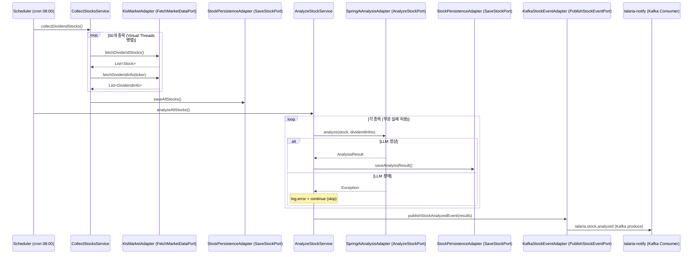

# talaria-invest 구현 가이드

> WHY 중심으로 읽고, skeleton 코드를 채워 나가는 학습형 구현 가이드

---

## 1. Overview

**talaria-invest**는 배당주 데이터를 수집하고 AI로 분석해 추천 결과를 생성하는 서비스다.
전체 시스템에서 **데이터 흐름의 시작점**이자 **유일한 Kafka Producer** 역할을 맡는다.

```
[Scheduler 트리거]
    → KIS API에서 50개 종목 수집 (Virtual Threads 병렬)
    → Spring AI(LLM)로 배당 안정성 분석 (부분 실패 허용)
    → MySQL에 성공 종목만 저장
    → Kafka talaria.stock.analyzed produce
    → talaria-notify가 소비해 다채널 알림 발송
```

포트: **8081** | 패키지: `io.github.snuggle.talaria.invest`

---

## 2. Why This Exists

### 왜 이 서비스가 별도로 존재하는가?

배당주 분석은 **외부 API 의존성이 높고 처리 시간이 길다**. notify와 합쳐 놓으면:
- KIS API 장애가 알림 발송까지 전파된다
- 분석 로직 변경이 알림 코드에 영향을 준다
- 두 도메인을 각각 독립 스케일링할 수 없다

Kafka로 분리함으로써 invest 장애 ↔ notify 장애가 서로 격리된다.

### 왜 Hexagonal Architecture(포트 & 어댑터)?

```
[문제] KIS API를 직접 의존하면 테스트에서 실제 API를 호출해야 한다.
[문제] OpenAI → Claude 교체 시 서비스 코드 수정이 필요하다.

[해결] 포트(인터페이스)를 경계로 두면:
  - 테스트에서 포트의 Mock 구현체 사용 가능
  - 어댑터만 교체해 외부 의존성 변경 가능 (설정 또는 구현체 1개)
```

### 왜 Spring AI?

직접 OpenAI SDK를 쓰면 `openaiClient.chat(...)` 호출이 코드에 박힌다.
Spring AI의 `ChatClient`를 쓰면 `application.yml` 설정만 바꿔 모델 교체가 가능하다.
GPT-4o → Claude Sonnet → Ollama(로컬, 무료) 전환이 코드 변경 없이 된다.

---

## 3. Architecture Flow



---

## 4. Layer Breakdown

### domain (핵심, 외부 의존성 zero)

```
domain/model/
  Stock           - 종목 (ticker, name, market, currentPrice)
  DividendInfo    - 배당 이력 (year, quarter, dividendPerShare, dividendYield)
  AnalysisResult  - AI 분석 결과 (grade, expectedYield, summary)
  Recommendation  - 추천 등급 (grade, reasoning, validUntil)
domain/vo/
  Grade           - STRONG_BUY | BUY | HOLD | SELL
```

**경계 원칙**: 도메인 모델은 Spring, JPA, Kafka를 import하지 않는다.

### application (유스케이스 오케스트레이션)

```
application/port/in/          ← 진입 계약 (Controller가 의존)
  CollectStocksUseCase        - collectDividendStocks(), refreshStockInfo()
  AnalyzeStockUseCase         - analyzeAllStocks(), analyzeStock(), publishAnalysisResults()
  GetStocksQuery              - 조회 전용 포트

application/port/out/         ← 외부 의존 계약 (어댑터가 구현)
  FetchMarketDataPort         - fetchDividendStocks(), fetchDividendInfo(), fetchCurrentPrice()
  SaveStockPort               - saveAllStocks(), saveStock(), saveAnalysisResult()
  LoadStockPort               - findAllActiveStocks(), findByTicker(), findDividendInfoByTicker()
  AnalyzeStockPort            - analyze(stock, dividendInfos)
  PublishStockEventPort       - publishStockAnalyzedEvent()

application/usecase/          ← 포트를 조합한 구현체
  CollectStocksService        - @Scheduled + FetchMarketDataPort + SaveStockPort
  AnalyzeStockService         - LoadStockPort + AnalyzeStockPort + SaveStockPort + PublishStockEventPort
```

### adapter (외부 세계 연결)

| 패키지 | 구현 포트 | 기술 |
|--------|-----------|------|
| `adapter/in/web` | - | Spring MVC Controller |
| `adapter/out/market` | `FetchMarketDataPort` | 한국투자증권 KIS REST API |
| `adapter/out/ai` | `AnalyzeStockPort` | Spring AI ChatClient |
| `adapter/out/persistence` | `SaveStockPort`, `LoadStockPort` | JPA + MySQL |
| `adapter/out/messaging` | `PublishStockEventPort` | KafkaTemplate |

---

## 5. Key Design Decisions

| 결정 | 이유 | 트레이드오프 |
|------|------|-------------|
| **Hexagonal Architecture** | KIS API, LLM, DB를 각각 독립적으로 교체 가능해야 함 | 파일 수 증가, 초기 설계 비용 |
| **Virtual Threads로 병렬 수집** | 50개 종목 × (KIS API 응답 대기) = 순차 처리 시 ~50초; 병렬로 ~2초로 단축 | 디버깅 스택 트레이스가 달라 보일 수 있음 |
| **부분 실패 허용 (partial failure)** | LLM 장애 시 전체 배치 실패보다 성공 종목만 처리가 서비스 가용성에 낫다 | 매일 분석 종목 수가 달라질 수 있음 |
| **Spring AI ChatClient 추상화** | application.yml 한 줄로 GPT-4o ↔ Claude ↔ Ollama 전환 | Spring AI 버전 업에 종속 |
| **Kafka produce (fire-and-forget 아님)** | `whenComplete`로 실패 로깅 → 발행 실패 인지 가능 | 동기 확인이 필요한 경우는 별도 처리 필요 |
| **ScheduleLog 분리 (독립 Aggregate)** | 수집/분석 실패 이력을 Stock과 독립적으로 추적 가능 | 테이블 하나 추가 |

---

## 6. Implementation Steps

아래 순서로 구현한다. 각 단계마다 WHY를 이해한 뒤 skeleton을 채운다.

### Step 1 — 도메인 모델 확정

**WHY**: 외부 의존성이 없는 순수 Java 클래스라 가장 먼저 완성해야 테스트 작성이 쉽다.

- [ ] `Stock`, `DividendInfo`, `AnalysisResult`, `Recommendation` 필드 완성
- [ ] `Grade` enum 값 확인 (STRONG_BUY, BUY, HOLD, SELL)
- [ ] 도메인 모델 단위 테스트 작성 (JPA, Spring 없이)

### Step 2 — 포트(인터페이스) 정의

**WHY**: 포트를 먼저 정의해야 어댑터 구현 없이 서비스 로직 테스트가 가능하다.

- [ ] `FetchMarketDataPort` 메서드 시그니처 확정
- [ ] `AnalyzeStockPort` 메서드 시그니처 확정
- [ ] `PublishStockEventPort` 메서드 시그니처 확정
- [ ] `SaveStockPort`, `LoadStockPort` 분리 확인 (쓰기/읽기 포트 구분)

### Step 3 — JPA 엔티티 & 레포지토리

**WHY**: 도메인 모델과 DB 스키마는 동일하지 않을 수 있다 (컬럼 이름, 관계 매핑). 엔티티를 도메인과 분리해야 DB 변경이 도메인에 영향을 주지 않는다.

- [ ] `StockEntity`, `DividendInfoEntity`, `AnalysisResultEntity` 완성
- [ ] `@Table`, `@Column` 이름을 DB 스키마(docs/03)와 일치시킴
- [ ] `StockPersistenceAdapter.toEntity()`, `toDomain()` 매핑 메서드 구현
- [ ] `SaveStockPort`, `LoadStockPort` 구현

> **skeleton 참조**: `adapter/out/persistence/StockPersistenceAdapter.java`

### Step 4 — KIS API 어댑터 (FetchMarketDataPort 구현)

**WHY**: 실제 KIS API 연동 전에 포트 인터페이스를 Mock으로 대체해 서비스 로직 테스트가 가능하다. 어댑터는 나중에 채워도 된다.

- [ ] `KisMarketAdapter.fetchDividendStocks()` — KIS 배당주 종목 리스트 조회
- [ ] `KisMarketAdapter.fetchDividendInfo(ticker)` — 배당 이력 조회
- [ ] `KisMarketAdapter.fetchCurrentPrice(ticker)` — 현재가 조회
- [ ] KIS OAuth2 토큰 발급 및 캐싱 (Redis TTL 활용)
- [ ] **Virtual Threads 적용**: `Executors.newVirtualThreadPerTaskExecutor()`로 종목별 병렬 수집

> **skeleton 참조**: `adapter/out/market/KisMarketAdapter.java`

### Step 5 — Spring AI 어댑터 (AnalyzeStockPort 구현)

**WHY**: LLM 응답은 JSON이지만 형식이 항상 보장되지 않는다. 파싱 실패도 예외로 던져서 상위 서비스의 부분 실패 정책이 동작하게 한다.

- [ ] `SpringAiAnalysisAdapter.analyze()` 구현
- [ ] 프롬프트 템플릿 완성 (종목 정보 + 배당 이력 → JSON 응답)
- [ ] `ChatClient.prompt().user(...).call().content()` 호출
- [ ] JSON 파싱: `ObjectMapper` 사용 (현재 skeleton의 직접 파싱은 취약)
- [ ] 예외를 catch하지 않고 throw → `AnalyzeStockService`가 skip 처리

> **skeleton 참조**: `adapter/out/ai/SpringAiAnalysisAdapter.java`

### Step 6 — CollectStocksService

**WHY**: `@Scheduled`가 붙어 있어 스케줄러가 직접 호출한다. Virtual Threads를 여기서 적용해 50개 종목을 병렬로 수집한다.

- [ ] `@Scheduled(cron = "0 0 8 * * MON-FRI")` 확인
- [ ] 종목별 배당 이력 수집 루프에 Virtual Thread pool 적용
- [ ] 실패 종목은 `log.warn` 후 계속 진행 (부분 실패 허용)
- [ ] `saveAllStocks()` 호출로 MySQL 저장

> **skeleton 참조**: `application/usecase/CollectStocksService.java`

### Step 7 — AnalyzeStockService

**WHY**: LLM 호출 실패가 전체 배치를 멈추면 안 된다. try-catch로 개별 종목 실패를 격리하고, 성공한 종목 결과만 모아 Kafka에 publish한다.

- [ ] `analyzeAllStocks()`: 활성 종목 목록 로드 → 순차 분석 (LLM rate limit 고려)
- [ ] 개별 종목 실패 시 `log.error` + continue (결과 리스트에 포함하지 않음)
- [ ] `publishAnalysisResults()`: 성공 목록으로 `StockAnalyzedEvent` 빌드 → Kafka publish
- [ ] ScheduleLog 업데이트 (totalCount, successCount, failCount)

> **skeleton 참조**: `application/usecase/AnalyzeStockService.java`

### Step 8 — Kafka Producer 어댑터

**WHY**: `kafkaTemplate.send()`는 비동기이므로 `.whenComplete()`으로 발행 성공/실패를 반드시 로깅해야 운영 시 추적이 가능하다.

- [ ] `KafkaStockEventAdapter.publishStockAnalyzedEvent()` 완성
- [ ] topic: `talaria.stock.analyzed`, key: `event.eventId()`
- [ ] `whenComplete((result, ex) -> ...)` 성공/실패 로깅

> **skeleton 참조**: `adapter/out/messaging/KafkaStockEventAdapter.java`

### Step 9 — REST Controller

**WHY**: 수동 트리거 API와 조회 API를 분리된 Controller로 노출해야 Gateway 라우팅이 가능하다.

- [ ] `StockController`: GET /stocks, GET /stocks/{ticker}, POST /stocks
- [ ] `AnalysisController`: GET /analysis, GET /analysis/{ticker}, POST /analysis/run
- [ ] Scheduler 수동 실행: POST /scheduler/collect, POST /scheduler/analyze
- [ ] `ApiResponse<T>` 공통 응답 래퍼 적용

### Step 10 — 통합 테스트

**WHY**: KIS API, LLM은 실제 호출 없이 검증해야 한다. 포트 Mock으로 서비스 로직만 격리 테스트한다.

- [ ] `CollectStocksServiceTest`: `FetchMarketDataPort` Mock → 부분 실패 시나리오
- [ ] `AnalyzeStockServiceTest`: `AnalyzeStockPort` Mock → LLM 장애 시 성공 종목만 publish
- [ ] `SpringAiAnalysisAdapterTest`: 고정 JSON 응답으로 파싱 검증
- [ ] `KafkaStockEventAdapterTest`: `EmbeddedKafka`로 produce 검증

---

## 7. Code Skeleton Reference

### `/guide-me` 사용법

구현 중 막힌 부분이 생기면 다음과 같이 호출한다:

```
/guide-me
"AnalyzeStockService에서 Virtual Threads로 LLM 병렬 호출을 구현하려고 하는데,
 부분 실패 허용 정책을 어떻게 구조화해야 할지 모르겠어.
 현재 코드: [붙여넣기]
 원하는 동작: [설명]"
```

### 주요 skeleton 파일 위치

| 구현 대상 | skeleton 파일 |
|-----------|--------------|
| AI 분석 어댑터 | `adapter/out/ai/SpringAiAnalysisAdapter.java` |
| 수집 서비스 | `application/usecase/CollectStocksService.java` |
| 분석 서비스 | `application/usecase/AnalyzeStockService.java` |
| KIS API 어댑터 | `adapter/out/market/KisMarketAdapter.java` |
| Kafka Producer | `adapter/out/messaging/KafkaStockEventAdapter.java` |
| JPA 어댑터 | `adapter/out/persistence/StockPersistenceAdapter.java` |

### application.yml LLM 설정 (교체 가능)

```yaml
spring:
  ai:
    openai:
      api-key: ${OPENAI_API_KEY}
      chat.options.model: gpt-4o
    # anthropic:            # Claude로 교체 시
    #   api-key: ${ANTHROPIC_API_KEY}
    # ollama:               # 로컬 LLM (무료)
    #   base-url: http://localhost:11434
```

---

## 8. Learning Insights

### 포트폴리오에서 강조할 포인트

1. **Hexagonal Architecture 실전 적용**
   포트 인터페이스를 경계로 도메인 로직과 외부 의존성을 완전히 분리했다.
   KIS API → 다른 증권사 API 교체 시 어댑터 1개만 교체하면 된다.

2. **Virtual Threads로 50개 종목 병렬 수집**
   Java 25의 Project Loom을 활용해 WebFlux/Reactor 없이 고동시성을 달성했다.
   I/O 대기가 많은 외부 API 호출에서 스레드를 블로킹하지 않는다.

3. **LLM 부분 실패 허용 패턴**
   AI 분석 실패가 전체 배치를 중단시키지 않도록 종목별 예외 격리를 설계했다.
   실패 종목은 ScheduleLog에 기록하고 성공 종목만 downstream으로 흐른다.

4. **Spring AI로 LLM 벤더 종속성 제거**
   GPT-4o, Claude, Ollama를 설정 한 줄로 교체 가능한 추상화 구조를 적용했다.

---

## 9. Pitfalls & Gotchas

### Pitfall 1: `@Transactional`과 Virtual Threads 혼용

`@Transactional` 메서드 내에서 Virtual Thread를 fork하면 **DB 커넥션이 각 스레드에 독립적으로 할당**된다.
HikariCP 풀 크기(기본 10)보다 스레드 수(50)가 많으면 커넥션 고갈이 발생한다.

```
[해결] 수집 단계(CollectStocksService)와 저장 단계를 분리:
  1. Virtual Threads로 API 호출 (DB 트랜잭션 없음)
  2. 결과를 모아 단일 트랜잭션으로 일괄 저장
```

### Pitfall 2: LLM JSON 응답 파싱 실패

Spring AI의 `ChatClient.call().content()`는 String을 반환한다.
LLM은 JSON 앞뒤에 설명을 붙이거나 마크다운 코드 블록으로 감쌀 수 있다.

```
[잘못된 응답 예시]
"물론입니다! 분석 결과입니다:\n```json\n{\"grade\": \"BUY\"...}\n```"

[해결]
1. 프롬프트에 "JSON만 응답하세요, 다른 텍스트 없이"를 명시
2. 응답에서 ```json ... ``` 블록 제거 후 파싱
3. Spring AI의 BeanOutputConverter 활용 (자동 JSON 파싱)
```

### Pitfall 3: Kafka `send()`는 비동기 — 예외가 호출 스택에 전파되지 않는다

```java
kafkaTemplate.send(topic, key, event); // 이게 실패해도 예외 안 남
// whenComplete 없으면 실패를 영원히 모른다

// 반드시:
kafkaTemplate.send(topic, key, event)
    .whenComplete((result, ex) -> {
        if (ex != null) log.error("Kafka publish 실패", ex);
    });
```

---

## 10. Vault Log Prompt

구현을 마친 후 Obsidian에 기록할 때 다음 프롬프트를 `/vault-log` 에이전트에 복붙한다:

```
/vault-log

오늘 talaria-invest 서비스 구현 완료.

배운 것:
- Hexagonal Architecture: FetchMarketDataPort 인터페이스를 먼저 정의하고 KisMarketAdapter로 구현.
  Controller → UseCase → Port 방향으로 의존성이 흐르고, 어댑터는 포트를 바라봄.
- Virtual Threads: Executors.newVirtualThreadPerTaskExecutor()로 50개 KIS API 호출을 병렬화.
  @Transactional 경계 밖에서 fork해야 커넥션 풀 고갈을 피할 수 있음.
- Spring AI: ChatClient.prompt().user(...).call().content()로 LLM 추상화.
  application.yml만 바꾸면 GPT ↔ Claude ↔ Ollama 전환 가능.
- 부분 실패 허용: analyzeAllStocks()에서 종목별 try-catch로 LLM 장애 격리.
  실패 종목은 skip, 성공 종목만 Kafka로 publish.

막혔던 부분:
- [여기에 실제 겪은 어려움 작성]

다음 단계: talaria-notify 구현 시작
```
