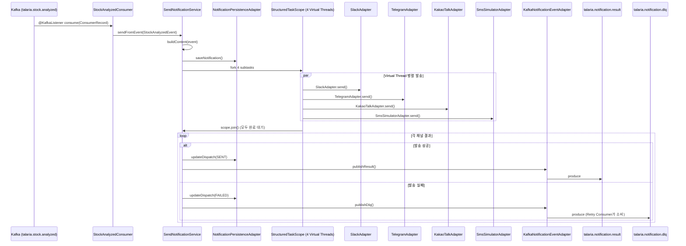

# talaria-notify 구현 가이드

> WHY 중심으로 읽고, skeleton 코드를 채워 나가는 학습형 구현 가이드

---

## 1. Overview

**talaria-notify**는 Kafka에서 분석 완료 이벤트를 소비해 SMS·카카오톡·텔레그램·슬랙으로 알림을 동시 발송하는 서비스다.
전체 시스템에서 **유일한 Kafka Consumer**이자 **다채널 발송의 실행자** 역할을 맡는다.

```
[Kafka talaria.stock.analyzed consume]
    → SendNotificationService 호출
    → StructuredTaskScope로 4채널 병렬 발송 (Virtual Threads)
    → 각 채널 결과를 MySQL에 저장
    → 성공: Kafka talaria.notification.result produce
    → 실패: Kafka talaria.notification.dlq produce → Retry Consumer
```

포트: **8082** | 패키지: `io.github.snuggle.talaria.notify`

---

## 2. Why This Exists

### 왜 notify를 invest와 분리했는가?

```
[통합 서비스의 문제]
invest 분석 중 텔레그램 API가 느리면 → 다음 종목 분석이 지연된다
알림 채널 추가 시 → 분석 코드를 건드려야 한다
채널별 재시도 정책 → 분석 로직과 얽힌다

[분리 후]
invest: "분석 완료" Kafka에 던지고 바로 다음 작업
notify: Kafka에서 꺼내 채널별로 독립 발송
→ 두 도메인이 Kafka 인터페이스 하나만으로 계약
```

### 왜 ChannelAdapter 인터페이스 패턴?

OCP(Open/Closed Principle): 새 채널을 추가할 때 기존 코드를 수정하면 안 된다.

```java
// 구현체 클래스 1개만 추가하면 끝
@Component
@ConditionalOnProperty(prefix = "talaria.notify.channels.discord", name = "enabled", havingValue = "true")
public class DiscordAdapter implements ChannelAdapter { ... }
// SendNotificationService는 한 줄도 수정하지 않아도 된다
```

Spring이 `List<ChannelAdapter>`를 자동 주입해 `Map<ChannelType, ChannelAdapter>`로 변환한다.

### 왜 Structured Concurrency?

4개 채널을 순차 발송하면 느린 채널 하나가 전체를 지연시킨다.
Virtual Thread만 쓰면 채널별 결과를 모으는 코드가 복잡해진다.
`StructuredTaskScope`는 "모든 subtask가 완료될 때까지 기다린다"는 구조를 명시적으로 표현한다.

```
SlackAdapter.send()       → subtask 1 (Virtual Thread)
TelegramAdapter.send()    → subtask 2 (Virtual Thread)
KakaoTalkAdapter.send()   → subtask 3 (Virtual Thread)
SmsSimulatorAdapter.send()→ subtask 4 (Virtual Thread)
                           ↘ scope.join() → 모두 완료 후 진행
```

---

## 3. Architecture Flow



---

## 4. Layer Breakdown

### domain (핵심, 외부 의존성 zero)

```
domain/model/
  Notification          - 알림 마스터 (title, content, channels, priority, sourceType)
  NotificationDispatch  - 채널별 발송 단위 (channel, status, retryCount, sentAt)
domain/vo/
  ChannelType           - SMS | KAKAO | TELEGRAM | SLACK
  Priority              - HIGH | NORMAL | LOW
  DispatchStatus        - PENDING → SENDING → SENT | FAILED → RETRY → DLQ
```

**상태 전이 규칙**: `NotificationDispatch`는 도메인 메서드(`markSending()`, `markSent()`, `markFailed()`)를 통해서만 상태가 바뀐다. 외부에서 직접 setStatus() 호출 금지.

### application (유스케이스 오케스트레이션)

```
application/port/in/
  SendNotificationUseCase   - sendFromEvent(), sendManual()
  GetNotificationQuery      - findById(), findRecent(), findDispatchesByNotificationId()

application/port/out/
  SaveNotificationPort      - saveNotification(), saveDispatch(), updateDispatch()
  PublishNotificationEventPort - publishResult(), publishDlq()

application/usecase/
  SendNotificationService   - Kafka 이벤트 → 채널 병렬 발송 → 결과 publish
```

### adapter (외부 세계 연결)

| 패키지 | 역할 | 기술 |
|--------|------|------|
| `adapter/in/messaging` | Kafka Consumer | `@KafkaListener` |
| `adapter/in/web` | REST API (수동 발송, 조회) | Spring MVC |
| `adapter/out/channel` | 채널별 발송 구현체 | RestClient |
| `adapter/out/persistence` | MySQL 저장 | JPA |
| `adapter/out/messaging` | Kafka Producer | KafkaTemplate |

---

## 5. Key Design Decisions

| 결정 | 이유 | 트레이드오프 |
|------|------|-------------|
| **ChannelAdapter OCP 패턴** | 새 채널 추가 시 기존 서비스 코드 무수정 | 채널 설정이 분산 (각 어댑터 + yml) |
| **`@ConditionalOnProperty`로 채널 ON/OFF** | 설정 하나로 특정 채널만 비활성화 가능 | 런타임 동적 변경 불가 (재시작 필요) |
| **StructuredTaskScope.ShutdownOnFailure** | 한 채널 익셉션이 scope를 닫지만, 개별 채널 오류는 try-catch로 내부 처리 | scope 종료 시 인터럽트 전파 주의 |
| **NotificationDispatch 상태를 SENDING으로 먼저 저장** | 서버 재시작 시 SENDING 상태 감지로 중복 발송 방지 가능 | 추가 DB write 발생 |
| **DLQ로 실패 메시지 분리** | 실패 재처리를 정상 흐름과 격리, 최대 3회 지수 백오프 재시도 | DLQ Consumer 별도 구현 필요 |
| **notification_key로 멱등성 보장** | 같은 이벤트가 2번 오더라도 중복 발송 방지 (DB unique constraint) | insert 전 체크 필요 |

---

## 6. Implementation Steps

아래 순서로 구현한다. 각 단계마다 WHY를 이해한 뒤 skeleton을 채운다.

### Step 1 — 도메인 모델 & 상태 머신

**WHY**: 발송 상태(PENDING→SENDING→SENT|FAILED)는 비즈니스 규칙이다. 상태 전이 메서드를 도메인에 두면 잘못된 전이를 컴파일 타임에 차단할 수 있다.

- [ ] `Notification` 필드 완성 (id, title, content, channels, priority, sourceType, sourceId)
- [ ] `NotificationDispatch` 상태 머신 메서드 구현:
  - `markSending()` — PENDING → SENDING
  - `markSent(messageId)` — SENDING → SENT, sentAt 기록
  - `markFailed(reason)` — SENDING → FAILED, errorMessage 기록
  - `incrementRetry()` — retryCount 증가
- [ ] `ChannelType`, `Priority`, `DispatchStatus` enum 완성

### Step 2 — ChannelAdapter 인터페이스 & 구현체

**WHY**: 인터페이스를 먼저 정의해야 `SendNotificationService`가 구현 없이 컴파일된다.

- [ ] `ChannelAdapter` 인터페이스 확인 (channel(), send(), isAvailable())
- [ ] `SendResult` record: `ok(messageId)`, `fail(errorMessage)` 팩토리 메서드
- [ ] `SlackAdapter` — Webhook URL POST (RestClient)
- [ ] `TelegramAdapter` — Bot API sendMessage
- [ ] `KakaoTalkAdapter` — 카카오 나에게 보내기 API
- [ ] `SmsSimulatorAdapter` — 로그 출력 (실제 SMS API 없이 동작)
- [ ] `@ConditionalOnProperty`로 각 채널 활성/비활성 제어

> **skeleton 참조**: `adapter/out/channel/SlackAdapter.java`, `TelegramAdapter.java`

### Step 3 — JPA 엔티티 & 영속성 어댑터

**WHY**: Notification과 NotificationDispatch는 1:N 관계다. 조회 시 dispatch 목록을 함께 가져와야 하므로 fetch 전략 선택이 중요하다.

- [ ] `NotificationEntity`, `NotificationDispatchEntity` 완성
- [ ] DB 스키마(docs/03)와 컬럼 이름 일치 확인
- [ ] `NotificationPersistenceAdapter.saveNotification()` — 저장 후 id 세팅
- [ ] `saveDispatch()`, `updateDispatch()` — 상태 변경을 DB에 반영
- [ ] `findDispatchesByNotificationId()` — notificationId로 dispatch 목록 조회
- [ ] `findTopN()` — 최근 N건 조회 JPQL

> **skeleton 참조**: `adapter/out/persistence/NotificationPersistenceAdapter.java`

### Step 4 — Kafka Consumer (StockAnalyzedConsumer)

**WHY**: `@KafkaListener`가 예외를 잡지 못하면 Kafka가 자동 재시도한다. 예외를 throw하면 Consumer Group의 offset이 커밋되지 않아 메시지가 재처리된다. 의도적인 동작이지만 무한 루프를 피하려면 DLQ 설정과 함께 사용해야 한다.

- [ ] `StockAnalyzedConsumer.consume()` 구현 확인
- [ ] `StockAnalyzedEvent` 역직렬화 설정 확인 (Kafka 설정에서 deserializer 지정)
- [ ] 예외 발생 시 `throw e` — Kafka ErrorHandler가 DLQ로 라우팅

> **skeleton 참조**: `adapter/in/messaging/StockAnalyzedConsumer.java`

### Step 5 — SendNotificationService (핵심 로직)

**WHY**: StructuredTaskScope는 "스코프 내 모든 subtask 완료 후 join"이라는 구조적 보장을 준다. 채널별 결과를 `scope.join()` 이후에 안전하게 수집할 수 있다.

- [ ] `sendFromEvent()`: 이벤트 → Notification 빌드 → `send()` 호출
- [ ] `sendManual()`: REST 요청 → Notification 빌드 → `send()` 호출
- [ ] `send()` 내부:
  ```java
  try (var scope = new StructuredTaskScope.ShutdownOnFailure()) {
      channels.forEach(ch -> scope.fork(() -> dispatchToChannel(saved, ch)));
      scope.join();
  }
  ```
- [ ] `dispatchToChannel()`: adapter 조회 → isAvailable() 체크 → send() → 결과 저장 + publish
- [ ] 채널 어댑터 없을 때 FAILED로 처리 (NPE 방지)

> **skeleton 참조**: `application/usecase/SendNotificationService.java`

### Step 6 — Kafka Producer (결과 & DLQ)

**WHY**: 발송 결과를 Kafka로 publish하면 OpenSearch Kafka Connect Sink가 자동으로 인덱싱한다. DLQ topic으로 분리하면 실패 메시지만 Retry Consumer가 별도로 처리한다.

- [ ] `KafkaNotificationEventAdapter.publishResult()` — `talaria.notification.result` produce
- [ ] `KafkaNotificationEventAdapter.publishDlq()` — `talaria.notification.dlq` produce
- [ ] `whenComplete()` 로깅 — result와 dlq 모두 성공/실패 추적

> **skeleton 참조**: `adapter/out/messaging/KafkaNotificationEventAdapter.java`

### Step 7 — DLQ Retry Consumer

**WHY**: 실패한 메시지를 즉시 재시도하면 동일한 이유로 계속 실패한다. 지수 백오프(1초→2초→4초)로 간격을 두고 최대 3회 재시도한다. 3회 후에도 실패하면 로깅하고 포기한다.

- [ ] `DlqRetryConsumer` 구현 (`@KafkaListener(topics = "talaria.notification.dlq")`)
- [ ] `NotificationDispatch.retryCount` 체크 — 3회 초과 시 포기
- [ ] 지수 백오프: `Thread.sleep(1000L * (1L << retryCount))`
- [ ] 재시도 성공 시 `publishResult()`, 최종 실패 시 `log.error` + 상태를 DLQ로 기록

### Step 8 — REST Controller

**WHY**: 수동 발송과 조회 API를 노출해야 talaria-gateway를 통해 admin UI가 접근 가능하다.

- [ ] `NotificationController`:
  - POST `/api/notify/send` → `sendManual(command)`
  - GET `/api/notify/notifications` → 목록 조회 (페이징)
  - GET `/api/notify/notifications/{id}` → 상세 + dispatch 목록
  - GET `/api/notify/channels` → 채널 활성화 상태
- [ ] `ApiResponse<T>` 래퍼 적용

### Step 9 — 통합 테스트

**WHY**: 채널 어댑터는 외부 API를 호출하므로 Mock으로 대체해야 한다. StructuredTaskScope 동작 검증은 Mock 어댑터의 응답 타이밍으로 제어한다.

- [ ] `SendNotificationServiceTest`: `ChannelAdapter` Mock → 4채널 병렬 발송 결과 검증
- [ ] 채널 1개 실패 시 나머지 3개는 SENT, 1개는 FAILED 검증
- [ ] `StockAnalyzedConsumerTest`: `EmbeddedKafka`로 consume → `sendFromEvent()` 호출 검증
- [ ] `SlackAdapterTest`: MockWebServer (OkHttp)로 Slack Webhook 모킹

---

## 7. Code Skeleton Reference

### `/guide-me` 사용법

```
/guide-me
"SendNotificationService에서 StructuredTaskScope를 쓸 때
 한 채널이 Exception을 throw하면 다른 채널에 어떤 영향이 있는지 이해가 안 돼.
 ShutdownOnFailure vs ShutdownOnSuccess 차이도 설명해줘.
 현재 코드: [붙여넣기]"
```

### 주요 skeleton 파일 위치

| 구현 대상 | skeleton 파일 |
|-----------|--------------|
| Kafka Consumer | `adapter/in/messaging/StockAnalyzedConsumer.java` |
| ChannelAdapter 인터페이스 | `adapter/out/channel/ChannelAdapter.java` |
| Slack 구현체 | `adapter/out/channel/SlackAdapter.java` |
| Telegram 구현체 | `adapter/out/channel/TelegramAdapter.java` |
| 발송 서비스 (핵심) | `application/usecase/SendNotificationService.java` |
| JPA 어댑터 | `adapter/out/persistence/NotificationPersistenceAdapter.java` |
| Kafka Producer | `adapter/out/messaging/KafkaNotificationEventAdapter.java` |

### application.yml 채널 설정

```yaml
talaria:
  notify:
    channels:
      slack:
        enabled: true
        webhook-url: ${SLACK_WEBHOOK_URL:}
      telegram:
        enabled: true
        bot-token: ${TELEGRAM_BOT_TOKEN:}
        chat-id: ${TELEGRAM_CHAT_ID:}
      kakao:
        enabled: false         # 토큰 없으면 비활성화
      sms:
        enabled: true          # 시뮬레이터 - 항상 활성화
```

---

## 8. Learning Insights

### 포트폴리오에서 강조할 포인트

1. **OCP를 실현한 ChannelAdapter 패턴**
   새 알림 채널(Discord, Line 등)을 추가할 때 `ChannelAdapter` 구현 클래스 1개와 yml 설정만 추가하면 된다.
   `SendNotificationService`는 한 줄도 수정하지 않는다. 이것이 Open/Closed Principle의 실전 적용이다.

2. **Java 25 Structured Concurrency로 4채널 병렬 발송**
   `StructuredTaskScope`로 4채널을 동시에 발송하면서 모든 결과를 구조적으로 수집한다.
   순차 발송 대비 발송 시간이 max(채널 응답시간) 하나로 수렴한다.

3. **DLQ 기반 재시도 상태 머신**
   PENDING → SENDING → SENT|FAILED → RETRY → DLQ 상태를 도메인 모델 내 메서드로 관리했다.
   외부에서 직접 상태를 바꾸는 것을 차단해 불변식을 보장한다.

4. **Kafka를 통한 서비스 간 결합도 제거**
   talaria-invest의 장애가 talaria-notify에 전파되지 않는다.
   notify가 다운돼 있어도 Kafka에 메시지가 쌓이고, 복구 후 자동으로 처리된다.

---

## 9. Pitfalls & Gotchas

### Pitfall 1: `StructuredTaskScope.ShutdownOnFailure`의 오해

`ShutdownOnFailure`는 subtask 중 하나가 예외를 throw하면 **scope를 종료 요청**한다.
그러나 이미 실행 중인 다른 subtask는 즉시 중단되지 않는다. 자연스럽게 완료되거나 InterruptedException을 받는다.

```java
// dispatchToChannel() 내부에서 예외를 잡아야 한다
// 예외를 throw하면 scope가 닫히고 다른 채널도 영향을 받을 수 있다
private void dispatchToChannel(Notification notification, ChannelType channelType) {
    try {
        ChannelAdapter.SendResult result = adapter.send(notification);
        // 결과 처리...
    } catch (Exception e) {
        dispatch.markFailed(e.getMessage()); // 예외를 잡아 상태로 기록
        // throw하지 않음 — 다른 채널에 영향 주지 않음
    }
}
```

### Pitfall 2: Kafka Deserializer 설정 누락

`StockAnalyzedEvent`를 consumer에서 역직렬화하려면 Kafka 설정에 deserializer를 명시해야 한다.
누락 시 `SerializationException`으로 메시지를 영원히 처리 못하고 consumer lag가 쌓인다.

```yaml
spring:
  kafka:
    consumer:
      value-deserializer: org.springframework.kafka.support.serializer.JsonDeserializer
      properties:
        spring.json.trusted.packages: "io.github.snuggle.talaria.common.event"
        spring.json.value.default.type: "event.io.snuggle.talaria.common.StockAnalyzedEvent"
```

### Pitfall 3: `NotificationDispatch.id`가 null인 상태로 `updateDispatch()` 호출

`saveDispatch()` 직후 반환된 dispatch 객체에 `setId(saved.getId())`를 해줘야 한다.
id가 null인 채로 `updateDispatch()`를 호출하면 JPA가 새 레코드를 insert한다 (update가 아니라).

```java
// NotificationPersistenceAdapter.saveDispatch()에서:
NotificationDispatchEntity saved = dispatchRepo.save(entity);
dispatch.setId(saved.getId()); // ← 반드시 id를 domain 객체에 세팅
return dispatch;
```

---

## 10. Vault Log Prompt

구현을 마친 후 Obsidian에 기록할 때 다음 프롬프트를 `/vault-log` 에이전트에 복붙한다:

```
/vault-log

오늘 talaria-notify 서비스 구현 완료.

배운 것:
- ChannelAdapter OCP 패턴: List<ChannelAdapter>를 Map<ChannelType, ChannelAdapter>로 변환해
  채널 추가 시 서비스 코드 무수정. @ConditionalOnProperty로 채널별 ON/OFF.
- Structured Concurrency: StructuredTaskScope.ShutdownOnFailure로 4채널 병렬 발송.
  dispatchToChannel() 내부에서 예외를 잡아야 다른 채널에 영향 안 줌.
- DLQ 상태 머신: NotificationDispatch의 markSending(), markSent(), markFailed()로
  외부에서 직접 상태 변경 차단. DLQ Consumer에서 지수 백오프 재시도.
- Kafka deserializer: spring.json.trusted.packages 설정 필수.
  누락 시 consumer lag가 계속 쌓임.

막혔던 부분:
- [여기에 실제 겪은 어려움 작성]

다음 단계: [통합 테스트 / talaria-gateway / talaria-admin 중 선택]
```
